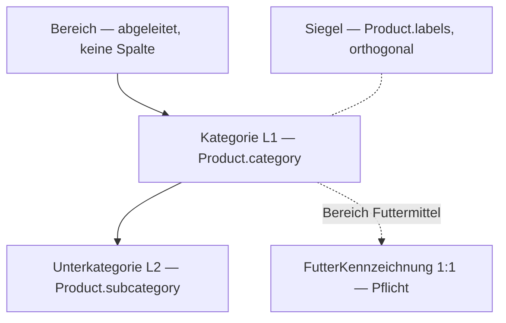

# Konzept: Bereiche — Lebensmittel und Futtermittel

Stand: 2026-09-22 · Status: **Bereiche 1 umgesetzt am 2026-09-23** · Basis: Taxonomie 1 (#100)
Geändert nach Rückfrage F6 im Sprint Bereiche 1: Betriebsnummer und Betriebsstatus gehören dem Hof (§3, §6.4, §8).
Geändert vor Bereiche 2 (2026-09-25): Der erste Bereich heißt in der Oberfläche „Hofladen"; die Hofseite trennt die Bereiche mit einem Umschalter (§6.1–6.3).
Verbindliche Quelle für die Sprints „Bereiche 1–3". Abweichungen nur nach Änderung dieser Datei.

---

## 1. Ziel und Nicht-Ziele

**Ziel.** Futtermittel werden ein eigener Bereich mit eigenen Kategorien, eigener Kennzeichnung, eigener Abgabelogik und vorbereiteter Steuerlogik — ohne dass Kunden, die Eier suchen, davon etwas merken.

**Nicht-Ziele in diesem Konzept.**
- Keine Entscheidung über Steuersätze. Nur die Struktur, die sie später trägt.
- Keine dritte Taxonomie-Ebene, keine Freitext-Kategorien.
- Kein eigener B2B-Shop. B2B ist eine Facette.
- Keine Preisverhandlung, kein Angebotswesen.

---

## 2. Fachmodell



### 2.1 Bereich
Ein Bereich ist eine Funktion der Kategorie: `bereichVon(category)`. **Keine Spalte** — zwei Wahrheiten driften.

| Bereich | Kategorien (L1) |
|---|---|
| `LEBENSMITTEL` | MILCH, EIER, FLEISCH, FISCH, GEMUESE, OBST, BROT, HONIG, GETRAENKE |
| `FUTTERMITTEL` | HEU_STROH, GETREIDE_KOERNER, MISCHFUTTER, ERGAENZUNGSFUTTER |
| `SONSTIGES` | BRENNHOLZ, SONSTIGES, sowie `category = null` |

### 2.2 Unterkategorien im Bereich Futtermittel
Regel wie überall: L2 ist die Achse, auf der ein Produkt genau *einer* Ausprägung angehört und nach der Kunden zuerst suchen.

| L1 | L2 | Begründung |
|---|---|---|
| Heu & Stroh | WIESENHEU, LUZERNE, STROH, SILAGE | Kunden suchen die Art, nicht den Rechtsbegriff |
| Getreide & Körner | MAIS, HAFER, GERSTE, WEIZEN, ROGGEN, TRITICALE | Kornart |
| Mischfutter | — | Tierart ist die Facette |
| Ergänzungsfutter | — | Tierart ist die Facette |

Erweiterung: ein neuer L2-Wert nur, wenn ein Hof ihn tatsächlich anbietet — Eintrag hier, dann im Enum.

### 2.3 Altlast aus Taxonomie 1
`FUTTERMITTEL` (L1) und `EINZELFUTTERMITTEL`, `MISCHFUTTERMITTEL`, `ERGAENZUNGSFUTTERMITTEL` (L2) bleiben im Enum, weil Postgres Enum-Werte nicht sauber entfernt. Zod lehnt sie ab. Cleanup-Sprint frühestens vier Wochen nach Bereiche 1.

### 2.4 Der Rechtsbegriff wandert in die Kennzeichnung
Die Futtermittelart nach VO (EG) 767/2009 ist eine **Pflichtangabe**, kein Navigationselement. Sie steht in `FutterKennzeichnung.futtermittelart` und ist an die Kategorie gebunden:

| Kategorie | erlaubte Futtermittelart |
|---|---|
| Heu & Stroh, Getreide & Körner | nur EINZELFUTTERMITTEL |
| Mischfutter | nur ALLEINFUTTERMITTEL |
| Ergänzungsfutter | ERGAENZUNGSFUTTERMITTEL oder MINERALFUTTERMITTEL |

### 2.5 Dual-Use: zwei Produkte
Mais als Lebensmittel und Mais als Futter sind **zwei Datensätze mit zwei Beständen**. Zwingend, weil nur einer die Kennzeichnung trägt und beide verschiedene Steuersätze haben können. Kein gemeinsamer Bestand, keine Verknüpfung im Schema. Später: Aktion „Als Futtermittel anlegen", die Name und Foto kopiert.

### 2.6 Siegel bleiben orthogonal
`labels` (BIO, GENTECHNIKFREI, AMA_GUETESIEGEL) gilt in allen Bereichen unverändert.

---

## 3. Datenmodell

```prisma
enum ProductCategory {
  MILCH EIER FLEISCH FISCH GEMUESE OBST BROT HONIG GETRAENKE
  HEU_STROH GETREIDE_KOERNER MISCHFUTTER ERGAENZUNGSFUTTER   // neu
  BRENNHOLZ SONSTIGES
  FUTTERMITTEL                                                // ALTLAST, Zod lehnt ab
}

enum ProductSubcategory {
  // … bestehende Werte …
  WIESENHEU LUZERNE STROH SILAGE                              // neu
  MAIS HAFER GERSTE WEIZEN ROGGEN TRITICALE                   // neu
  // EINZELFUTTERMITTEL MISCHFUTTERMITTEL ERGAENZUNGSFUTTERMITTEL — ALTLAST
}

enum ProductUnit { STUECK KG G LITER ML M3 PAKET BALLEN BIGBAG }   // BALLEN, BIGBAG neu
enum Abgabe { ALLE NUR_BETRIEBE }
enum Futtermittelart { EINZELFUTTERMITTEL ALLEINFUTTERMITTEL ERGAENZUNGSFUTTERMITTEL MINERALFUTTERMITTEL }
enum NettoEinheit { KG LITER }
enum Betriebsstatus { PRIMAERPRODUKTION REGISTRIERT ZUGELASSEN }
enum KaeuferArt { PRIVAT BETRIEB }

model Product {
  // … unverändert …
  abgabe Abgabe @default(ALLE)      // ≠ ALLE nur im Bereich Futtermittel
  @@index([category])
}

model Farm {
  // … unverändert …
  betriebsnummer String?                          // LFBIS, BAES/BVL oder α-Nummer — Eigenschaft des Hofs
  betriebsstatus Betriebsstatus?                  // erklärt betriebsnummer
}

model FutterKennzeichnung {
  // … bestehende Felder: zusammensetzung, analytischeBestandteile, zusatzstoffe,
  //     gebrauchshinweis, bestaetigtAm, zielTierarten …
  // registrierungsnummer: ALTLAST — nicht mehr geschrieben, nur Rückfall beim
  //     Lesen, wenn Farm.betriebsnummer leer ist; Entfernung im Cleanup-Sprint
  futtermittelart Futtermittelart                 // Pflicht
  nettoMenge      Decimal  @db.Decimal(10, 3)     // Pflicht — Inhalt EINES Gebindes
  nettoEinheit    NettoEinheit                    // Pflicht
  rohprotein      Decimal? @db.Decimal(5, 2)      // % — Filter/Vergleich; Freitext bleibt Pflichtangabe
  rohfaser        Decimal? @db.Decimal(5, 2)
  rohfett         Decimal? @db.Decimal(5, 2)
  rohasche        Decimal? @db.Decimal(5, 2)
}

model Order {
  // … unverändert …
  kaeuferArt     KaeuferArt @default(PRIVAT)
  betriebsnummer String?                          // nur bei BETRIEB
}

model OrderItem {
  // … unverändert …
  vatRate Decimal @db.Decimal(5, 2)               // Snapshot zum Kaufzeitpunkt
}
```

**Bewusst nicht:** `Farm.besteuerung` (pauschaliert / regelbesteuert / Kleinunternehmer). Gehört in einen eigenen Steuer-Sprint mit Steuerberater.

### Betriebsstatus und Nummern — was wo steht
Die Nummer ist eine Eigenschaft des Hofs, nicht des Produkts: Wer Futter kauft, verkauft meist keines und hat gar keine Kennzeichnung. Sie steht in den Hof-Einstellungen.

| Status | Nummer in `Farm.betriebsnummer` | Wer |
|---|---|---|
| PRIMAERPRODUKTION | LFBIS-Nummer | Hof verkauft nur selbst erzeugtes Futter |
| REGISTRIERT | BAES- bzw. BVL-Registrierungsnummer | Hof handelt oder lagert Futter |
| ZUGELASSEN | α-Nummer nach VO (EG) 183/2005 | Hof mischt mit zulassungspflichtigen Zusatzstoffen |

Die Plattform prüft die Nummer nicht. Der Hof bestätigt die Richtigkeit (`bestaetigtAm`).

---

## 4. Regeln (Zod und reine Funktionen)

### `src/lib/taxonomie.ts` — neu
- `bereichVon(category | null)`
- `BEREICH_KATEGORIEN: Record<Bereich, ProductCategory[]>`
- `futtermittelartenFuer(category)` nach Tabelle 2.4
- `GROSSGEBINDE_AB_KG = 25`, `istGrossgebinde(nettoMenge, nettoEinheit)` — Liter zählen 1:1 als kg
- Labels: „Heu & Stroh", „Getreide & Körner", „Mischfutter", „Ergänzungsfutter"; L2 deutsch

### `src/lib/mwst.ts` — neu
- `mwstStandard(category)`: Tabelle je Bereich, **initial überall 10**, Kommentar „Sätze nach Rücksprache Steuerberater". Nur Vorbelegung im Formular.
- Docblock, Pflicht: „Die endgültige Steuerrechnung braucht drei Eingaben — Bereich des Produkts, Besteuerung des Verkäufers (`Farm.besteuerung`, kommt im Steuer-Sprint) und Käuferart (`Order.kaeuferArt`). Diese Funktion verwendet nur die erste und liefert einen Vorschlag, keine Wahrheit."
- `order-totals.ts`: `summenJeSatz(positionen)` — Decimal, nie `number`.

### `schemas/product.ts`
| Regel | Fehlertext (Du-Form) |
|---|---|
| Futter Pflicht ⇔ Bereich Futtermittel, sonst verboten | bestehend |
| Altlast-Werte abgelehnt | „Diese Kategorie gibt es nicht mehr — bitte Heu & Stroh, Getreide & Körner, Mischfutter oder Ergänzungsfutter wählen." |
| `futtermittelart ∈ futtermittelartenFuer(category)` | „Ein Produkt aus Getreide & Körner ist ein Einzelfuttermittel." |
| `nettoMenge > 0`, Rohwerte 0–100 | „Bitte trag ein, wie viel ein Gebinde enthält — steht auf dem Sackanhänger." |
| `abgabe = NUR_BETRIEBE` nur im Bereich Futtermittel | „Die Abgabebeschränkung gibt es nur für Futtermittel." |
| `unit ∈ {BALLEN, BIGBAG}` ⇒ `unitSize` leer | „Bei Ballen und Big Bags steht das Gewicht in der Kennzeichnung." |
| `vatRate` Default aus `mwstStandard(category)` | — |

### `schemas/checkout.ts` und `/api/checkout` (serverseitig erneut)
- `kaeuferArt` Default PRIVAT.
- Enthält der Warenkorb eine Position mit `abgabe = NUR_BETRIEBE`: `kaeuferArt = BETRIEB` und `betriebsnummer` (min 5 Zeichen) Pflicht — „Dieses Futtermittel gibt der Hof nur an landwirtschaftliche Betriebe ab. Bitte trag deine Betriebsnummer ein."
- Der Warenkorb ist nie die Wahrheit; die Prüfung läuft im Checkout-Handler.

---

## 5. Invarianten (→ `docs/ai/ARCHITECTURE.md` §5)
- **Bereich ist abgeleitet.** Nie als Spalte, nie in `localStorage`, nie im Client entschieden.
- **Ein Produkt gehört zu genau einem Bereich.** Dual-Use = zwei Produkte.
- **`OrderItem.vatRate` ist ein Snapshot.** Wird beim Kauf aus `Product.vatRate` geschrieben, nie nachgelesen, nie rückwirkend geändert.
- **Bestandsabzug unverändert:** bedingtes `updateMany` mit `stock >= Menge`, je Produkt.
- **Nettomenge ist Gebinde-Inhalt, nicht Bestand.** `stock` zählt Gebinde.

---

## 6. UI

### 6.0 Anzeige-Bereiche *(geändert vor Bereiche 2)*
Die Oberfläche kennt zwei Bereiche: **„Hofladen"** und **„Futtermittel"**. Intern bleibt es bei `LEBENSMITTEL`, `FUTTERMITTEL`, `SONSTIGES` (§2.1); Hofladen = Lebensmittel + Sonstiges. Grund: Brennholz und Sonstiges gehören in den Hofladen und stünden unter „Lebensmittel" falsch. Das Label steht einmal in `taxonomie.ts` und gilt überall, wo ein Bereich angezeigt wird — Produktformular, /hoefe, Hofseite.

Beide Orte (/hoefe und Hofseite) teilen **einen** Umschalter „Hofladen | Futtermittel": volle Breite, zwei gleich breite Hälften, mindestens 44 px hoch, direkt über dem Inhalt, nicht klebend, aktive Hälfte gefüllt.

**Kaufbar** heißt überall: im Shop sichtbar UND freier Bestand (`stock − reservedStock`) über 0 — eine Funktion für Chips, Suche, Facetten, Karte und Grundpreis-Sortierung.

### 6.1 Produktformular (Bereiche 1)
- Kategorie-Sheet: zuerst **zwei Kacheln** „Hofladen — Lebensmittel und mehr" / „Futtermittel — Für Tiere" (Sonstiges liegt unter Hofladen), dann die Kategorien des Bereichs, dann L2 als Chips. *(Geändert vor Bereiche 2: „Hofladen" statt „Lebensmittel".)*
- Futter-Sektion: Futtermittelart (Auswahl, nur erlaubte), Nettomenge + Einheit mit Hilfetext „Durchschnittsgewicht eines Gebindes, wie auf dem Sackanhänger", Betriebsstatus mit Hilfetext, Rohwerte optional, Abgabe als Schalter „Nur an landwirtschaftliche Betriebe".
- Dual-Use-Hinweis: Existiert im selben Hof bereits ein Produkt gleichen Namens in einem anderen Bereich, zeigt das Formular unter dem Namen: „Du hast schon ein Produkt namens Mais im Bereich Hofladen. Das hier wird ein zweites, eigenes Produkt mit eigenem Bestand." Hinweis, kein Fehler, keine Sperre.
- Bestand-Label bei BALLEN/BIGBAG: „Bestand (Ballen)" mit „= 3.000 kg" aus `nettoMenge`.
- MwSt in „Details", vorbelegt aus `mwstStandard`, Hinweis „Standard für diese Kategorie".

### 6.2 Hofübersicht `/hoefe` (Bereiche 2)
- Oberste Weiche: Umschalter **„Hofladen | Futtermittel"** über den Kategorie-Chips. Sonstiges (Brennholz) erscheint unter Hofladen als letzter Chip. *(Geändert vor Bereiche 2.)*
- Die Ausblendung der Futter-Kategorien aus Bereiche 1 entfällt.
- Karte und Liste zeigen dieselbe Menge. Im Bereich Futtermittel nur Höfe mit mindestens einem kaufbaren Futtermittel.
- L2-Reihe nur, wenn die Ergebnismenge mindestens zwei Unterkategorien hat, mit Zählern (Höfe); Chips ohne Treffer fehlen.
- Facetten als eckige Chips: Bio, Gentechnikfrei, AMA; im Bereich Futtermittel zusätzlich „Für Tiere" (Sheet, Mehrfachwahl, Trefferzahl im Knopf) und „Gebinde: Klein (unter 25 kg) | Groß". Facetten gelten je Produkt: Ein Hof bleibt, wenn EIN kaufbares Produkt alle gewählten Bedingungen zugleich erfüllt.
- Sortierung nach Grundpreis im Bereich Futtermittel: Höfe nach dem günstigsten Kilopreis (Preis ÷ Nettomenge) ihrer passenden Futterprodukte; die Hofkarte zeigt den Wert („ab € 0,12 / kg").
- Alle Filter in der URL, teilbar und reload-fest — außer Bezugspunkt und Umkreis (der Standort verlässt den Browser nie). Ungültige Parameter werden verworfen, nie ein Fehler.
- Der Link auf die Hofseite trägt den Bereich mit (`?bereich=futter`).

### 6.3 Hofseite und Produktdetail (Bereiche 2)
- ~~Sektionierung nach Bereich, dann L1. Ein Hof mit Eiern und Heu zeigt zwei Blöcke.~~ *Geändert vor Bereiche 2:* Bietet der Hof Produkte in beiden Bereichen an, trennt der Umschalter sie (Standard Hofladen, `?bereich=futter` in der URL). Produkte des anderen Bereichs werden nicht gerendert. Bei nur einem Bereich kein Umschalter.
- Innerhalb eines Bereichs Sektionen nach Kategorie mit Überschrift. Reihenfolge der Sektionen: nach dem jeweils ersten Produkt der Kategorie in der Sortierung des Hofs (wer sein Lamm nach oben zieht, bekommt Fleisch zuerst); innerhalb nach sortOrder. Sprungmarken ab 12 Produkten im Bereich.
- Der Warenkorb bleibt gemeinsam — Eier und Heu vom selben Hof in einer Bestellung sind erlaubt.
- Die Bearbeitungsansicht des Hofs bleibt eine flache, ziehbare Liste.
- Produktdetail (für alle Produkte, zeigt auch die Kurzbeschreibung). Futter zusätzlich: Kategorie-Pills, Siegel-Badges, Akkordeon „Kennzeichnung" (zugeklappt, Pflichtangaben vollständig — Fernabsatz verlangt Einsehbarkeit vor dem Kauf), Chip „Nur an Betriebe" wenn gesetzt.

### 6.4 Checkout (Bereiche 1)
- Abschnitt „Betrieb" erscheint nur, wenn eine NUR_BETRIEBE-Position im Korb liegt: Auswahl „Ich bestelle als landwirtschaftlicher Betrieb" + Betriebsnummer.
- Ist die Session ein eingeloggter Bauer: Käuferart „Betrieb" vorbelegt, Betriebsnummer aus seinen Hof-Einstellungen (`Farm.betriebsnummer`, sonst leer). Der Bauer kann beides ändern — Vorbelegung, kein Zwang.

---

## 7. Migration

Zeitpunkt günstig: Produktion hat kein Futtermittel-Produkt, Dev nur das Seed-Heu.

1. Enum-Werte und Spalten anlegen; `OrderItem.vatRate` zunächst nullable.
2. Backfill:
```sql
   UPDATE "OrderItem" oi SET "vatRate" = p."vatRate"
   FROM "Product" p WHERE p.id = oi."productId" AND oi."vatRate" IS NULL;
   UPDATE "OrderItem" SET "vatRate" = 10 WHERE "vatRate" IS NULL;  -- gelöschtes Produkt, Vermerk in DEVELOPMENT.md
```
   danach `NOT NULL`.
3. Seed: Heu → HEU_STROH/WIESENHEU mit Futtermittelart und Nettomenge; Big-Bag-Hafer (GETREIDE_KOERNER/HAFER) mit NUR_BETRIEBE.
4. Altlast-Enum-Werte bleiben (siehe 2.3).

Migration immer zeigen, Freigabe abwarten, dann ausführen (`CLAUDE.md`, Hard Constraints).

---

## 8. Umsetzung in Sprints

| Sprint | Inhalt | Sichtbar für |
|---|---|---|
| **Bereiche 1** | Schema, Migration, Backfill, `taxonomie.ts`, `mwst.ts`, Zod, Produktformular, Checkout-Abschnitt Betrieb, Seed, Doku | Bauern |
| **Bereiche 2** | `/hoefe` Bereichs-Umschalter + Facetten, Hofseite sektioniert, Produktdetail Futter | Kunden |
| **Umfeld** | siehe `docs/konzepte/umfeld.md` — setzt Bereiche 1 voraus | Bauern |
| **Steuer** | `Farm.besteuerung`, echte Sätze, Käufertyp-abhängige Logik — nach Steuerberater | — |
| **Cleanup** | Altlast-Enum-Werte, `isOrganic`, `FutterKennzeichnung.registrierungsnummer` entfernen — frühestens 4 Wochen nach Bereiche 1 | — |

---

## 9. Entscheidungen, die gefallen sind
- Bereich statt Kategorie — ja, jetzt, solange es nichts kostet.
- Großgebinde ab 25 kg.
- NUR_BETRIEBE mit Betriebsnummer-Pflicht im Checkout — ja.
- `Farm.besteuerung` — verschoben.
- Silage und Triticale sind drin; Soja nicht, bis ein Hof es anbietet.

## 10. Glossar
- **Einzelfuttermittel** — ein Ausgangsstoff (Heu, Hafer). **Alleinfuttermittel** — Mischung, die den Bedarf allein deckt. **Ergänzungsfuttermittel** — Mischung, die mit anderem Futter gefüttert wird. **Mineralfuttermittel** — Ergänzungsfutter mit ≥ 40 % Rohasche. Alle nach VO (EG) 767/2009.
- **LFBIS** — österreichische Betriebsnummer land- und forstwirtschaftlicher Betriebe. **BAES** — Bundesamt für Ernährungssicherheit, registriert Futtermittelunternehmer. **BVL** — deutsches Pendant. **α-Nummer** — Kennnummer zugelassener Betriebe nach VO (EG) 183/2005.
- **Grundpreis** — Preis je kg oder L; bei Gebinden aus Preis ÷ Nettomenge.
