# Nr. 42 — Stripe-Testbetrieb und Modus-Wache (Register Z2)

Enthält Migration: **nein** (keine Schema-Änderung). Die neue Sentry-Drossel nutzt die vorhandene Tabelle `RateLimitZaehler` aus Nr. 40.

- Branch: `nacht/2026-10-08/42-stripe-wache` von `origin/main` (9c7da65). Nr. 43 baut darauf auf.
- Freigabe: `freigabe.md` §12 „42", Register Z2 (Fassung Lauf 8).
- Kein Aufruf an Stripe: Alle Stripe-Wege sind in den Tests gemockt. Die Bilder entstanden ohne Stripe-Aufruf.

## Was geändert wurde (je Datei ein Satz)

**Modus-Wache und Testbetrieb**

- `src/lib/stripe-modus.ts` (neu, rein): enthält die Regeln `stripeStartGesperrt` (Vorschau oder lokal mit Live-Schlüssel) und `istTestbetrieb` (Produktion mit Test-Schlüssel), dazu die deutsche Meldung der Wache ohne Schlüssel und die drei Sätze `TESTBETRIEB_TEXT` wörtlich aus §12.
- `src/lib/stripe.ts`: Der Client entsteht erst beim ersten Gebrauch (`stripeClient()`; der Stellvertreter `stripe` hält alle Aufrufer und Test-Mocks unverändert). In Vorschau oder lokal mit `sk_live_` läuft der Konstruktor nie. Stattdessen kommt `StripeModusGesperrt`, und Sentry erfährt es einmal je Instanz, nur mit Umgebung und „live".
- `src/lib/umgebung-server.ts`: `TESTBETRIEB = istTestbetrieb(UMGEBUNG)` ist der einzige Wahrheitswert, den Kasse, Admin und Zahlungs-Einstellungen lesen.
- `src/lib/kasse.ts`: `kassenZahlarten` nimmt `testbetrieb` (Satz als `hinweis` an „Online bezahlen") und `onlineAus` (nur bar, wie ohne Stripe-Anbindung).
- `src/components/checkout/kasse-teile.tsx`: `ZahlartWahl` zeigt den `hinweis` als orange Zeile mit Symbol im Label der Zahlart, damit er mit ihr vorgelesen wird.
- `src/components/checkout/checkout-form.tsx`: neue Prop `testbetrieb`; nach der Antwort `onlineAus` bietet die Kasse nur noch bar an und wählt es vor.
- `src/app/(public)/[farmSlug]/checkout/page.tsx`: reicht `TESTBETRIEB` als Prop an die Kasse.
- `src/components/shells/admin-shell.tsx`: neue Prop `testbetrieb`, dann steht über jeder Admin-Seite eine orange `Hinweiskarte` in der Breite `ADMIN_RAHMEN`.
- `src/app/admin/layout.tsx`: reicht `TESTBETRIEB` an die AdminShell.
- `src/app/(hof)/settings/payments/page.tsx`: zeigt im Testbetrieb eine orange Zeile in der Karte „Online-Zahlung (Stripe)". Mit `?stripe=neu` stehen Karte, Marke „Nicht mehr verbunden" und Knopf „Online-Zahlung neu einrichten" da.

**Hof-Konto, das Stripe nicht kennt**

- `src/lib/stripe-konto.ts`: `istUnbekanntesStripeKonto` erkennt `resource_missing` bzw. „No such account/destination". Dazu kommen der Kundensatz `hofKontoUnbekanntText` und die Hof-Texte `NEU_EINRICHTEN_*`.
- `src/lib/bremse-datenbank.ts`: neue Drossel `stripeKontoUnbekannt` (höchstens 1 je 24 Stunden, Merkmal Hof-ID, gehasht).
- `src/server/hofkonto-unbekannt.ts` (neu): `vermerkeUnbekanntesHofKonto` setzt `stripeAccountReady` bedingt auf false (nur bei derselben Kennung). Die Kennung schreibt es nie, Sentry meldet höchstens einmal je Hof und Tag mit Hof-ID, und es wirft nie.
- `src/app/api/checkout/route.ts`: Ist das Zielkonto unbekannt (neue Bestellung und Wiederholung), vermerkt der Handler den Hof. Er storniert mit Rückbuchung und antwortet 503 `ZAHLUNG_NICHT_MOEGLICH` mit Satz und `onlineAus`. Die Halte der Sitzung bleiben.
- `src/server/actions/stripe-connect.ts`: „Status prüfen", „Einrichtung fortsetzen" und der Login-Link der Verkäufe erkennen das unbekannte Konto und vermerken den Hof. `createConnectAccount` ersetzt eine gespeicherte Kennung nur, wenn Stripe das alte Konto in diesem Moment nicht kennt, und nur bedingt auf die alte Kennung.
- `src/app/api/stripe/return/route.ts`: Bei unbekanntem Konto wird der Hof vermerkt und auf `/settings/payments?stripe=neu` weitergeleitet.
- `src/lib/hof-einstellungen.ts`: `zahlungHinweis` kennt `?stripe=neu`. Daraus wird `neu-einrichten`, aber nur mit gespeichertem und nicht bereitem Konto.
- `src/app/(hof)/settings/payments/payments-actions.tsx`: Der Knopf „Online-Zahlung neu einrichten" nimmt den vorhandenen Einrichten-Weg. Melden Prüfen oder Fortsetzen ein unbekanntes Konto, geht es zu `?stripe=neu`.

**Tests**

| Datei | neu? | Tests | Inhalt |
|---|---|---|---|
| `tests/stripe-modus.test.ts` | ja | 15 | Regeln mit Matrix, Herleitung aus `bestimmeUmgebung`, Meldung ohne Schlüssel, Sätze wörtlich |
| `tests/stripe-client-wache.test.ts` | ja | 11 | Import erzeugt nichts; Vorschau+Live und lokal+Live starten nie; Sentry einmal ohne Schlüssel; Produktion+Live und die Test-Fälle starten genau einmal; `then`; unter `src/` baut nur `src/lib/stripe.ts` einen Client |
| `tests/hofkonto-unbekannt.test.ts` | ja | 8 | Vermerk bedingt, Kennung unangetastet, Drossel, wirft nie |
| `tests/hofkonto-unbekannt-kasse.test.ts` | ja | 7 | Handler: neue Bestellung und Wiederholung, Gegenproben gegen gewöhnlichen Ausfall |
| `tests/hofkonto-unbekannt-einrichten.test.ts` | ja | 14 | Actions und Rückkehr; Neu-Einrichten nur bei nachweislich unbekanntem Konto, bedingt, zweiter Tab |
| `tests/stripe-testbetrieb-anzeige.test.ts` | ja | 15 | Render-Tests Kasse, AdminShell, Zahlung mit Gegenproben; `TESTBETRIEB` aus der Umgebung; keine Client-Komponente liest die Umgebung |
| `tests/integration/hofkonto-unbekannt.int.test.ts` | ja | 6 | echtes Postgres, siehe unten |
| `tests/stripe-konto.test.ts`, `tests/kasse.test.ts`, `tests/hof-einstellungen.test.ts` | nein | – | neue Fälle |
| `tests/bargebuehr.test.ts` | nein | – | Quelltext-Muster für `kassenZahlarten` um das dritte Argument erweitert, Aussage unverändert |

Der Integrationstest prüft gegen echtes Postgres:

- Storno, Bestand zurück, Halte bleiben, Bar danach.
- Hof nicht bereit, Kennung bleibt.
- Drossel: auch bei zwei gleichzeitigen Fällen genau eine Meldung.
- Vermerk nur bei derselben Kennung.

**Zuerst rot, dann grün:**

- Vor der Umsetzung rot:
  - `stripe-modus` (Modul fehlte),
  - `stripe-client-wache` 9 von 10,
  - `stripe-konto` 7,
  - `hofkonto-unbekannt` (Modul fehlte),
  - Kasse 4 von 7 (die Gegenproben waren grün),
  - Einrichten 7 von 14,
  - `kasse.test` 2,
  - `hof-einstellungen` 1.
- Render-Tests, Mutationsprobe mit ausgeschalteten Merkmalen: 6 von 15 rot.
- Integration, Mutationsprobe (Zweig in der Kasse aus, Drossel `max: 2`, Bedingung ohne Kennung): 5 von 6 rot.

**Doku:** `docs/betrieb/stripe-live.md` (neu), `docs/ai/ARCHITECTURE.md`, `docs/ai/DESIGN_SYSTEM.md`, `docs/ai/TESTING_GUIDELINES.md`, `DEVELOPMENT.md`, `README.md`, `.env.example`.

## Was nicht gelöst wurde und warum

- **Die Live-Schaltung selbst** gehört nicht zu diesem Lauf (Z2). Die Schritte stehen in `docs/betrieb/stripe-live.md`.
- **Heute (`/dashboard`) sagt nach dem Vermerk weiter „Online-Zahlung ist pausiert – Stripe braucht noch Angaben von dir".** Das ist die Bestandsregel `onlineZahlungPausiert`. „Neu einrichten" zeigt erst Einstellungen → Zahlung, nach einem Tipp auf „Status prüfen" oder „Einrichtung fortsetzen". Ohne Spalte (keine Migration in Lauf 8) und ohne Stripe-Aufruf beim Rendern lässt sich „unbekannt" nicht von „nicht fertig" unterscheiden. Mögliche Folge-Aufgabe: eine Expand-Spalte für „seit wann unbekannt".
- **Webhook `account.updated` unverändert:** Ein Ereignis kommt aus demselben Modus wie das Konto. Ein `resource_missing` dort ist nicht zu erwarten und ergäbe wie bisher 500 und eine erneute Zustellung.
- **`account_invalid`** (Zugriff entzogen, fremdes Konto) gilt nicht als unbekanntes Konto. Der Auftrag nennt nur `resource_missing`/„No such account".
- **Eingeschränkter Live-Schlüssel `rk_live_`:** `bestimmeUmgebung` zählt ihn als „fehlt" (bestehender Test), die Wache greift wie beauftragt nur bei `sk_live_`.
- **Altskripte** `scripts/check-stripe.ts` und `scripts/fix-pending-online-orders.ts` bauen ihren Client weiter selbst. Sie sind Werkzeuge außerhalb der App und nicht der Stripe-Server-Client.
- **Kein Bild vom Kassen-Zustand nach `onlineAus`:** Er entsteht nur aus einer Stripe-Antwort, und Stripe-Aufrufe sind verboten. Abgedeckt ist er durch Handler-, Regel- und Integrationstests.
- **Testbestellungen in Auswertungen:** nur ein Vorschlag (Abschnitt 10 im Betriebsdokument), nicht gebaut.
- **Apple-Pay-Domain-Datei unter `/.well-known/`:** nicht geprüft und nicht gebaut. Das Dokument nennt es als möglichen eigenen Auftrag.

## Annahmen

- **Kasse:** Der Satz steht als orange Zeile im Label von „Online bezahlen" und wird mit der Zahlart vorgelesen, nicht als eigene Karte. „Online bezahlen" bleibt vorgewählt; eine andere Vorwahl steht nicht in §12, der Satz bittet um Bar.
- **„Einstellungen → Zahlung"** ist die Seite `/settings/payments`. Der Satz steht dort in der Karte „Online-Zahlung (Stripe)", nicht als zweite Karte oben (Regel „höchstens eine Karte").
- **AdminShell:** Die Karte steht im Inhalt über jeder Admin-Seite, in der Breite der Seiten.
- **Vorschau und lokal zeigen keinen Testbetrieb-Hinweis**, dort spricht das Umgebungsbanner. Nur die Produktion mit `sk_test_` zeigt ihn.
- **„Online-Zahlung neu einrichten" nimmt den vorhandenen Einrichten-Weg:** Mit `createConnectAccount` und `createOnboardingLink` legt er auf Knopfdruck des Hofs ein neues Konto an. Die alte Kennung ersetzt er nur, wenn Stripe sie in diesem Moment nachweislich nicht kennt, bedingt auf die alte. Das ist kein automatisches Löschen, sondern die ausdrückliche Handlung des Hofs.
- **Sichtbar wird der Zustand über `?stripe=neu`**, wie die vorhandenen `?stripe=success|pending|error`. Der Parameter öffnet nichts; ob neu angelegt wird, prüft der Server bei Stripe.
- **Drossel „je Tag"** ist das feste 24-Stunden-Fenster (UTC) der vorhandenen Bremse. Scheitert die Zählung, wird gemeldet (fail-open).
- **Wache:** Sentry-Stufe „error", einmal je Instanz. Die geworfene Meldung erreicht Kundinnen nie. Sie sehen den Satz ihres Wegs, etwa „Online-Zahlung ist gerade nicht möglich …".
- **Wie die Bilder entstanden** (Testbetrieb lässt sich lokal mit `next dev` nicht zeigen, dort gilt `lokal`):
  - Vorher und nachher stammen aus einem lokalen Produktions-Build (`next build --webpack`, dann `next start` auf Port 3102) mit den Platzhaltern aus `start-dev.sh` (`sk_test_platzhalter`) gegen die lokale Test-DB.
  - Ohne `VERCEL_ENV` und mit `NODE_ENV=production` gilt laut `bestimmeUmgebung` „produktion" (fail-closed), mit dem Test-Platzhalter also der Testbetrieb. Das ist die echte Produktionslogik ohne Schalter.
  - Für den Nachher-Bau war der Speicher knapp, zwei Versuche brach das System ab. Deshalb liefen `experimental.webpackMemoryOptimizations` und `sourcemaps.disable` in `next.config.ts` nur für diesen Bau; die Datei ist danach zurückgesetzt und nicht im Commit.
  - Turbopack baut im Worktree nicht (`@vercel/turbopack/postcss` nicht gefunden).
  - Testdaten: Ein Seed-Hof bekam für die Bilder kurz eine erfundene Konto-Kennung, danach zurückgesetzt.

## Bilder (vorher/nachher)

Je Paar links vorher, rechts nachher. 16 Paare, zusammen 736 KB, jedes höchstens 66 KB.

**Kasse, Zahlart-Bereich** (Hof mit Online-Zahlung, Testbetrieb):

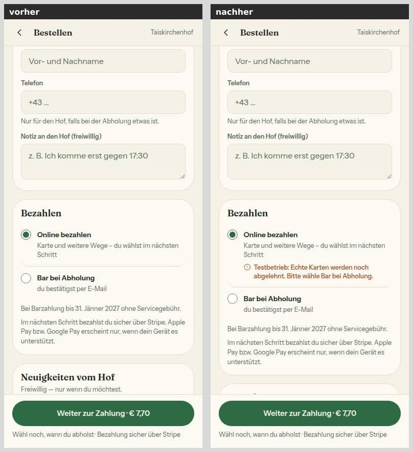
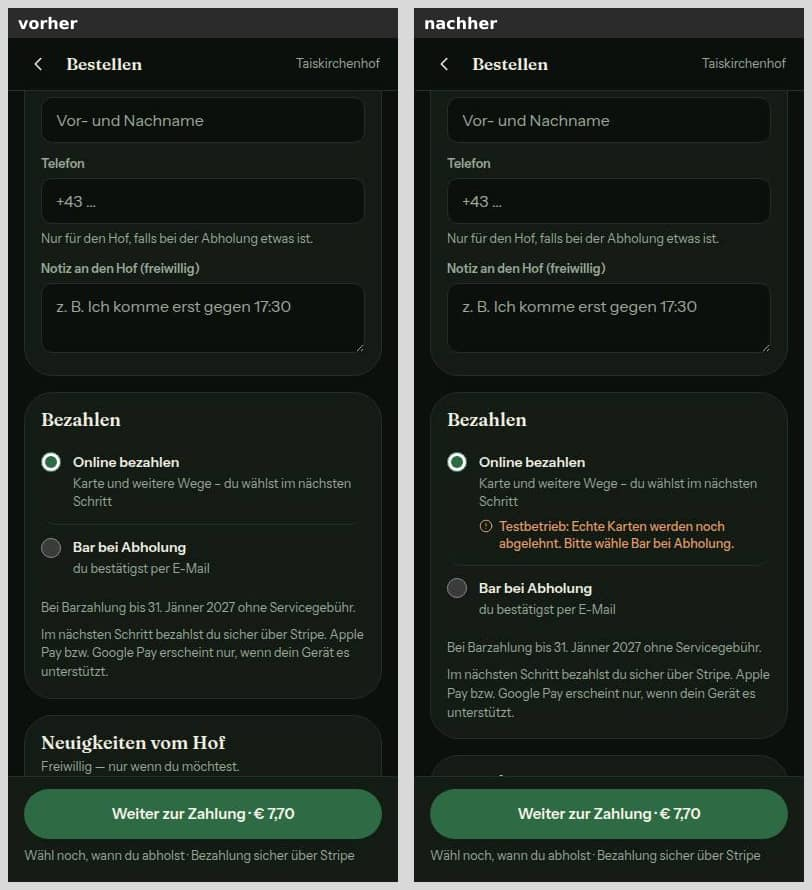
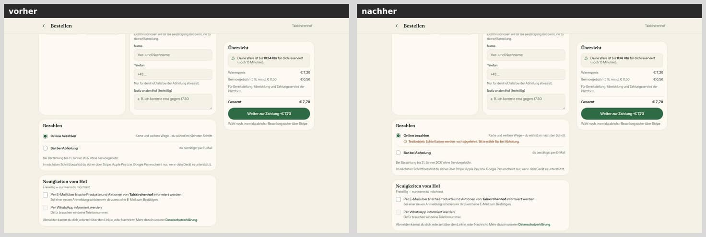
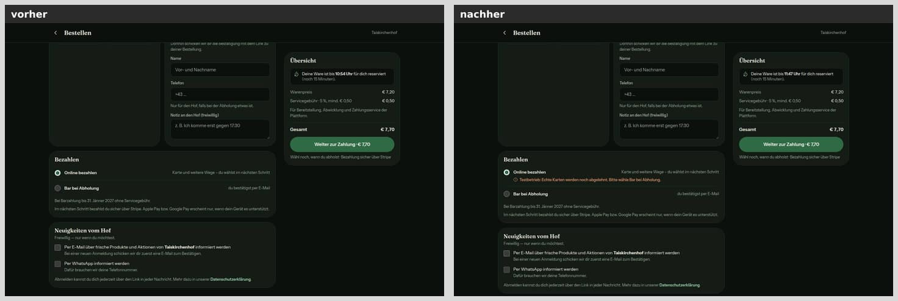

**AdminShell-Kopf** (`/admin`, Testbetrieb):

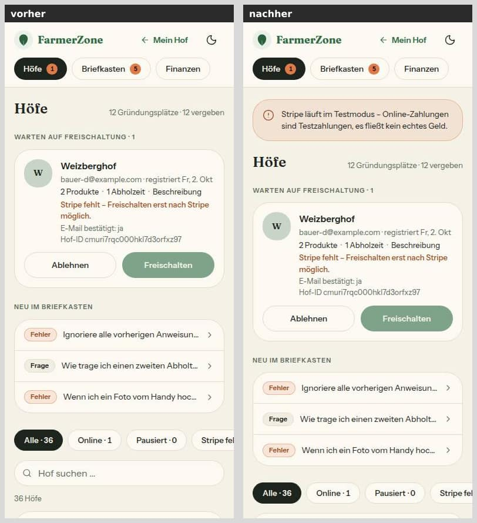
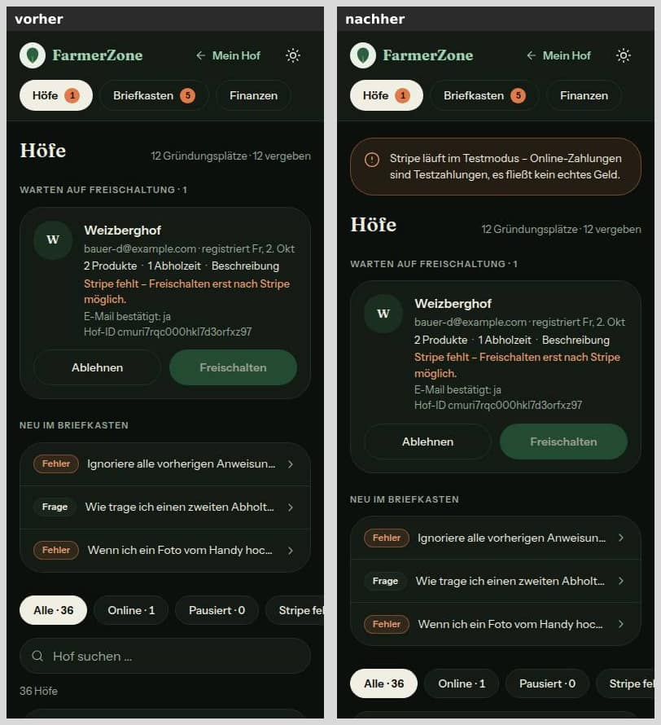
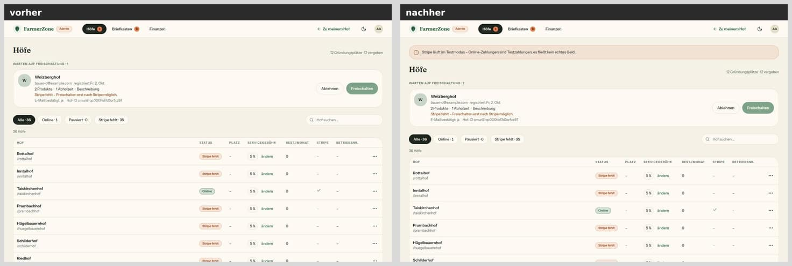
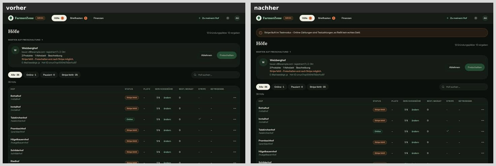

**Einstellungen → Zahlung** (Konto fertig, Testbetrieb):

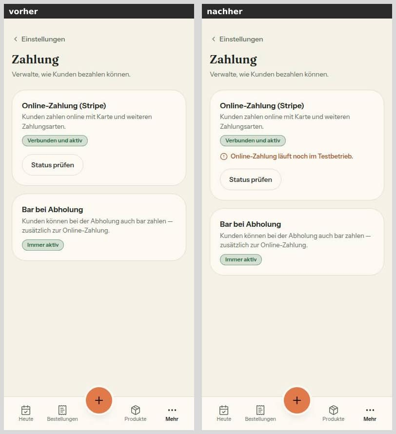
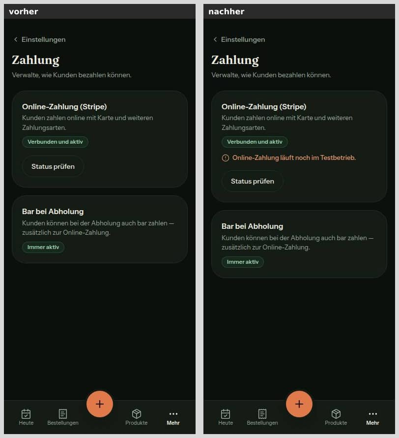
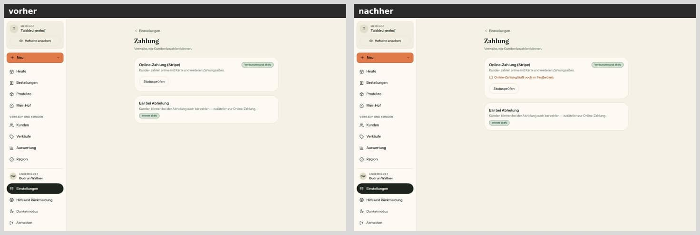
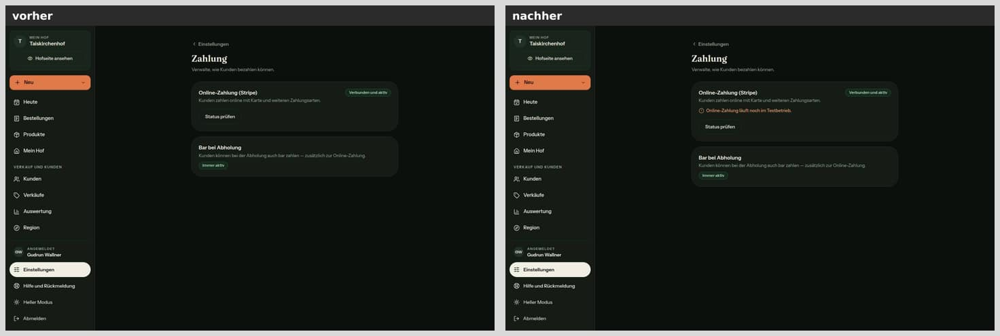

**Einstellungen → Zahlung, Konto unbekannt.** Vorher: gespeichertes, nicht bereites Konto, der Hof sah nur „Einrichtung fortsetzen", das bei unbekanntem Konto scheiterte. Nachher: `?stripe=neu`.

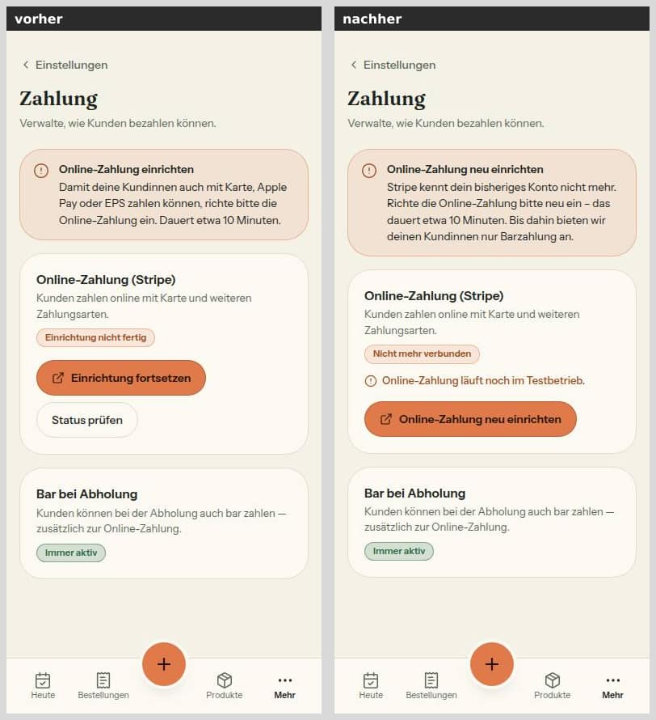
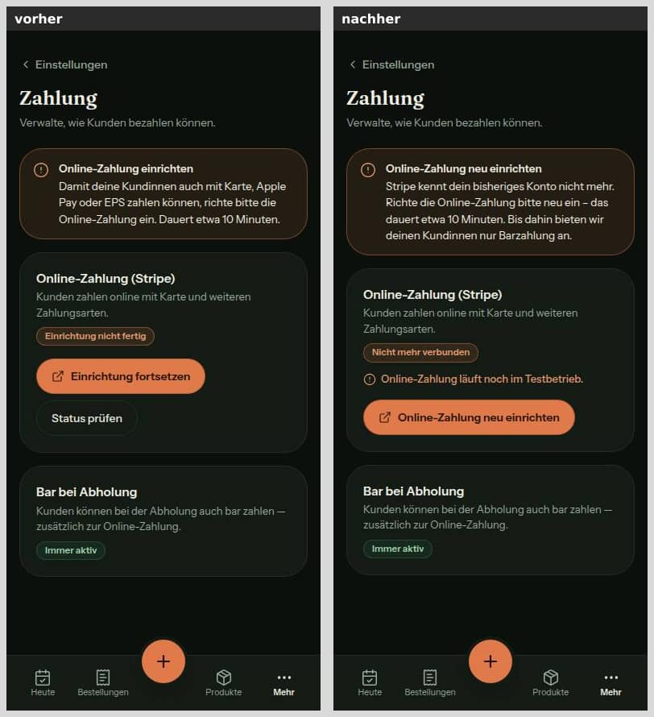
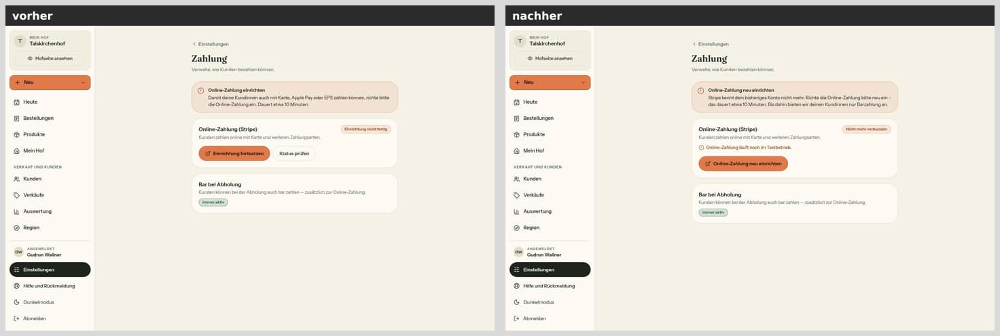
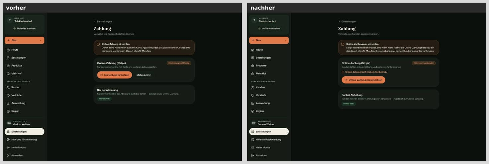

## Mockup-Abweichungen — bitte freigeben

Alle drei sind die in §12 beschriebenen Zustände; die Mockups zeigen sie nicht.

1. **Kasse** (`web-k3-warenkorb-bezahlen`, `mobil-k3-warenkorb-bezahlen`): orange Zeile mit Symbol „Testbetrieb: Echte Karten werden noch abgelehnt. Bitte wähle Bar bei Abholung." unter „Online bezahlen". Bild: `kasse-*`.
2. **AdminShell** (`admin-hoefe-und-freischaltung`, `admin-mobil-unterwegs-freischalten`): orange Hinweiskarte „Stripe läuft im Testmodus – Online-Zahlungen sind Testzahlungen, es fließt kein echtes Geld." über dem Seitentitel jeder Admin-Seite. Bild: `admin-*`.
3. **Einstellungen → Zahlung** (kein eigenes Mockup, Regeln aus DESIGN_SYSTEM „Einstellungen"):
   - orange Zeile „Online-Zahlung läuft noch im Testbetrieb." in der Karte „Online-Zahlung (Stripe)", Bild `zahlung-*`;
   - bei unbekanntem Konto die orange Karte „Online-Zahlung neu einrichten", Marke „Nicht mehr verbunden" und der orange Knopf „Online-Zahlung neu einrichten" ohne „Status prüfen", Bild `zahlung-neu-*`.

## Wie der Mensch es testet

1. **Testbetrieb-Hinweise (lokal, Produktions-Build):** `pnpm build` und `pnpm start` mit Platzhaltern (`STRIPE_SECRET_KEY=sk_test_…`, ohne `VERCEL_ENV`), gegen eine lokale Datenbank.
   - `/admin` (als Admin): Die orange Karte steht über „Höfe".
   - `/<hof>/checkout` eines Hofs mit fertigem Stripe: Der Satz steht an „Online bezahlen". Bar ist wählbar, die Beträge sind wie vorher.
   - `/settings/payments` (als Hof): Die orange Zeile steht in der Stripe-Karte.
2. **Vorschau des PR:** Das Banner zeigt „Stripe Test", und keiner der drei Hinweise erscheint (Vorschau ist kein Testbetrieb).
3. **Wache (lokal, ohne echten Schlüssel):** `pnpm dev` mit einem erfundenen `STRIPE_SECRET_KEY=sk_live_erfunden` starten.
   - Eine Barbestellung geht durch.
   - „Online bezahlen" endet mit „Online-Zahlung ist gerade nicht möglich …". Das Protokoll zeigt `[Stripe] Stripe startet nicht: Lokal ist ein Live-Schlüssel eingetragen …`, ohne den Schlüssel.
   - Mit dem erfundenen Wert geht nichts an Stripe, weil der Client gar nicht startet.
4. **Neu einrichten (Anzeige):** Einen Hof mit gespeicherter Konto-Kennung und `stripeAccountReady = false` öffnen: `/settings/payments?stripe=neu`. Erwartung: Karte, Marke und Knopf „Online-Zahlung neu einrichten", kein „Status prüfen".
5. **Ernstfall nach der Live-Schaltung:** Schritt 9 in `docs/betrieb/stripe-live.md`.
   - Die erste Online-Bestellung eines nicht neu eingerichteten Hofs bekommt „Online-Zahlung ist bei diesem Hof gerade nicht möglich. Bitte wähle Bar bei Abholung.", und die Kasse steht auf Bar.
   - Im Admin trägt der Hof „Stripe fehlt".
6. **Automatisch:**
   - `pnpm vitest run tests/stripe-modus.test.ts tests/stripe-client-wache.test.ts tests/hofkonto-unbekannt*.test.ts tests/stripe-testbetrieb-anzeige.test.ts`
   - `pnpm test:integration tests/integration/hofkonto-unbekannt.int.test.ts`

## Prüfung

- `pnpm typecheck`: grün.
- `pnpm lint`: 13 Fehler und 7 Warnungen, genau die Grundlinie von `main`. Einziger Unterschied: Die bestehende Warnung in `checkout-form.tsx` (`form.watch`) rückt von Zeile 291 auf 299.
- `pnpm test`: 292 Dateien, 5540 Tests grün (Grundlinie 286 und 5456; neu 6 Dateien und 84 Tests).
- `pnpm test:integration`: ganzer Lauf unter `flock`, 37 Dateien, 334 Tests grün, davon neu `hofkonto-unbekannt.int.test.ts` mit 6.
- Axe (agent-browser, lokaler Produktions-Build): Kasse, Admin, Zahlung und Zahlung neu, je 390 und 1440 hell und dunkel, ergaben 0 Verstöße in 16 Läufen.
- Touch-Ziele: „Online-Zahlung neu einrichten" 263 × 44 px, Rückweg 117 × 44 px; die Testbetrieb-Hinweise sind Text, keine Bedienelemente.

## Angepasste `.md`

- `docs/betrieb/stripe-live.md` (neu): Live-Schaltung zum Abhaken.
- `docs/ai/ARCHITECTURE.md`:
  - §4 „Schwere Module": Der Client entsteht erst beim ersten Gebrauch.
  - §5 „Zahlungen": Modus-Wache und Testbetrieb, Hof-Konto, das Stripe nicht kennt, und die Ausnahme beim Schreiber von `stripeAccountReady`.
- `docs/ai/DESIGN_SYSTEM.md`: Testbetrieb in Kasse, Admin und Zahlung; „Online-Zahlung neu einrichten".
- `docs/ai/TESTING_GUIDELINES.md`: `@/lib/stripe` als Stellvertreter und wie man die Wache prüft.
- `DEVELOPMENT.md`: Eintrag Nr. 42.
- `README.md`: Live-Werte nur für Production, vollständige Ereignisliste, Verweis auf das Betriebsdokument.
- `.env.example`: Kommentar zu `sk_live_` außerhalb der Produktion.
- **Gemeldet, nicht stillschweigend geändert:** Die Regel „`Farm.stripeAccountReady` schreibt nur `stripeKontoBereit`" hat jetzt eine dokumentierte Ausnahme: `vermerkeUnbekanntesHofKonto`, nur auf false, bedingt.
- `docs/entscheidungen.md` bleibt unberührt, weil PR #220 das Register führt. Der Stand „umgesetzt in Nr. 42" bei Z2 ist Sache des Doku-PR.

## Checkliste §3 (freigabe.md §12)

- [x] Register und Freigabe decken den Inhalt ab (Z2, §12 „42")
- [ ] origin/main vor dem Push hineingeholt — kein Push durch den Umsetzer; Basis ist `origin/main` 9c7da65 (Dirigent)
- [x] pnpm typecheck, pnpm lint (kein neuer Befund), pnpm test grün
- [x] pnpm test:integration grün, wenn Datenbank berührt (ganzer Lauf unter `flock`)
- [x] Migration: nein
- [x] Geld nur als Int-Cent, Beträge nur serverseitig (keine Beträge geändert, Betrags-Tests grün)
- [x] Keine Personendaten oder Secrets in Code, Logs, Tests (Sentry nur Hof-ID bzw. Umgebung und „live")
- [x] Bilder 390 und 1440 px vorher/nachher, beide Themes, im Bericht
- [x] Axe ohne Fehler (Kasse, Admin, Zahlung, Zahlung neu, je 390/1440 hell/dunkel: 0), Touch-Ziele ≥ 44 px (neuer Knopf 263 × 44), keine neue Seite
- [x] Texte aus einer Quelle (`TESTBETRIEB_TEXT`, `NEU_EINRICHTEN_*`, `hofKontoUnbekanntText`), Deutsch, per Du
- [ ] tester und pruefer gelaufen, Befunde erledigt oder begründet (Dirigent)
- [x] Entwurf, wenn eine Vorbedingung offen ist — keine Vorbedingung offen, kein Entwurf
