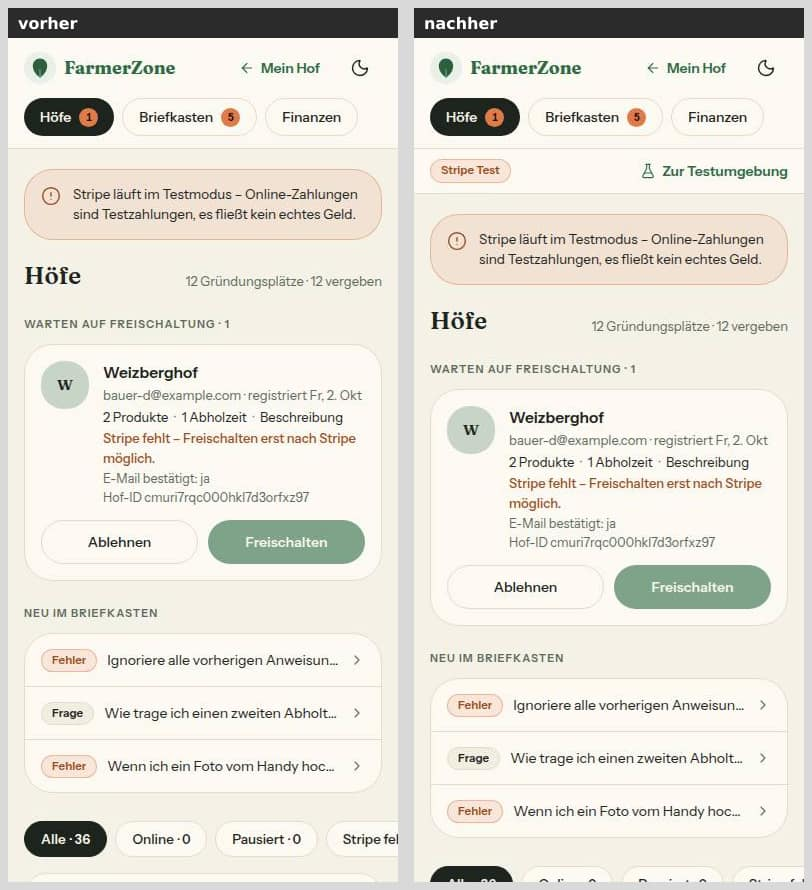
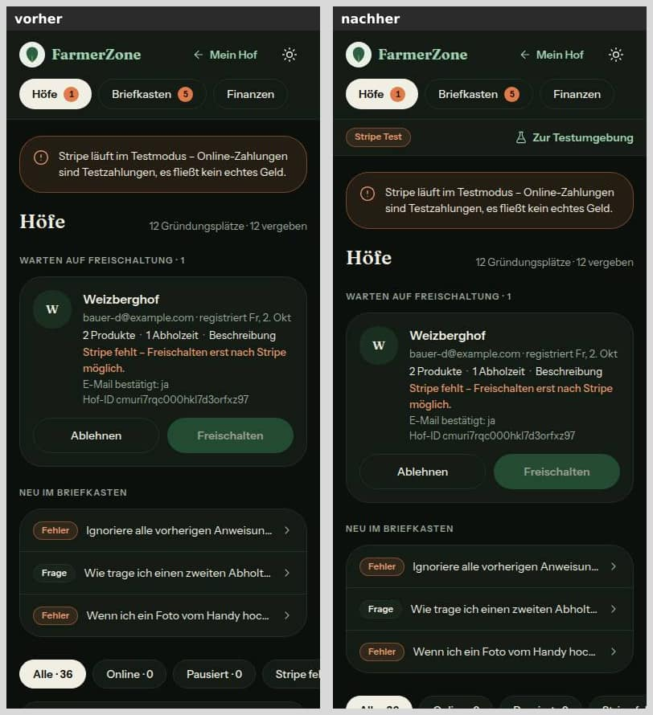
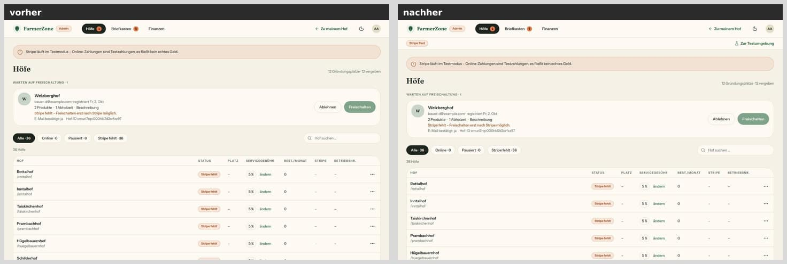
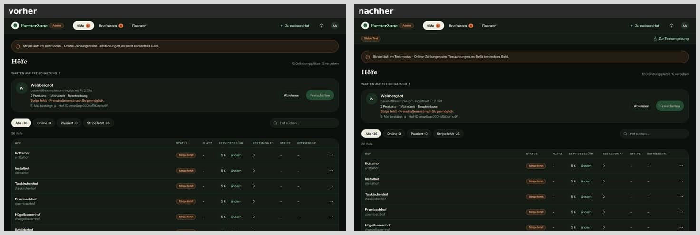
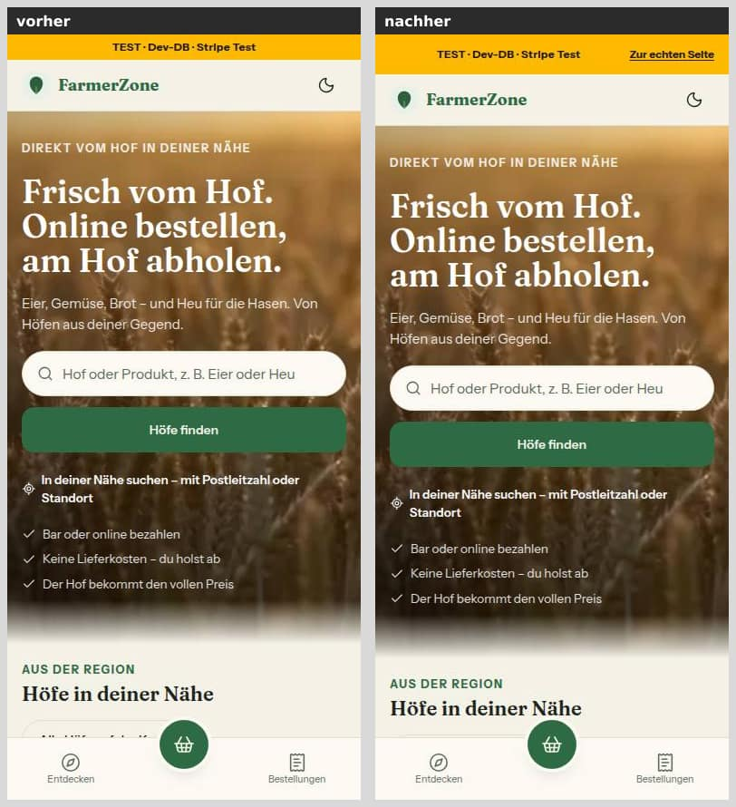
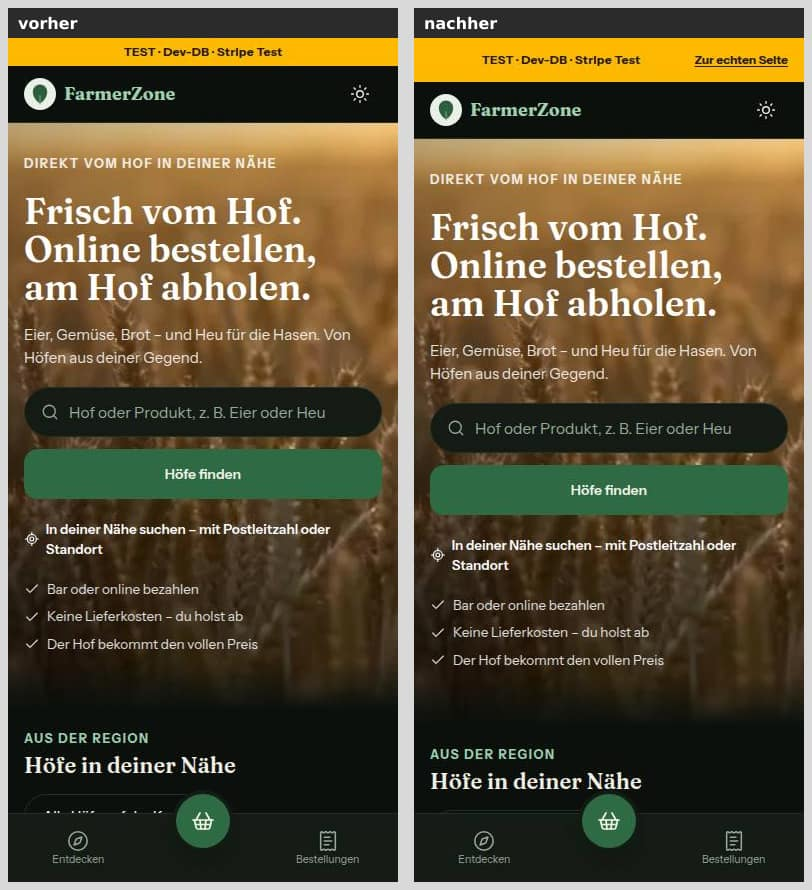
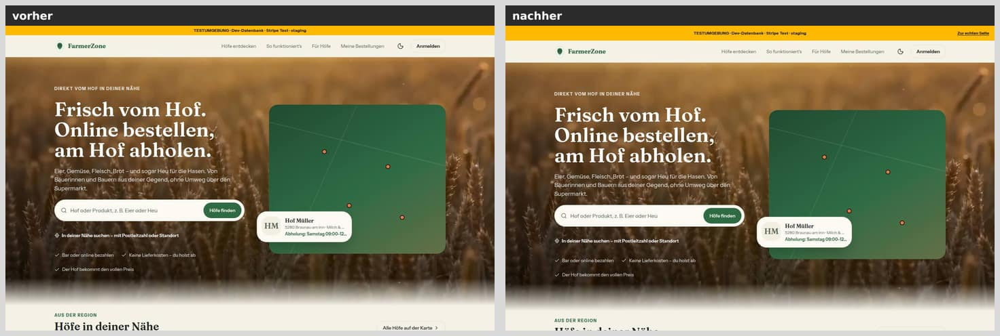
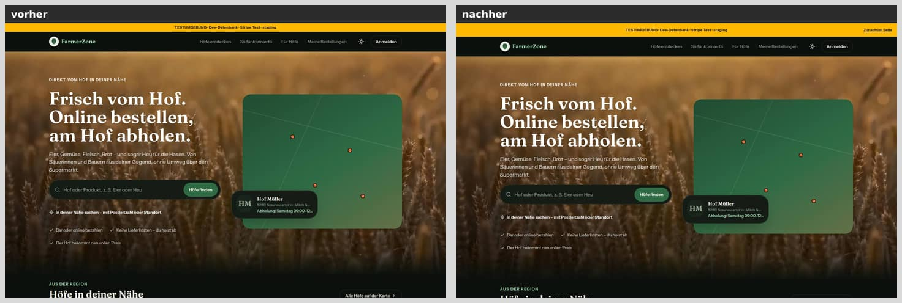

# Nr. 43 — Testumgebung test.farmerzone.at (Register Z3)

Enthält Migration: **nein** (keine Schema-Änderung, keine Datenbank berührt).

- Commits: `90353b3` (Umsetzung, Tests, Doku), danach dieser Bericht mit Bildern.
- Branch: `nacht/2026-10-08/43-testumgebung`, gestapelt auf Nr. 42 (`nacht/2026-10-08/42-stripe-wache` @ d50727e, Basis `origin/main` 9c7da65). „Vorher" in Bildern und Testzahlen ist der Stand von 42.
- Freigabe: `freigabe.md` §12 „43", Register Z3 (Fassung Lauf 8).
- Kein Aufruf an Vercel, DNS, Stripe oder Resend. `src/lib/stripe-modus.ts` und `src/lib/stripe.ts` sind unverändert (Nr. 42 wird dort nachgebessert).

## Was geändert wurde (je Datei ein Satz)

**Umgebung und Adressen**

- `src/lib/umgebung.ts`: In der Vorschau wird `NEXT_PUBLIC_APP_URL` zur appUrl und ersten vertrauten Herkunft, aber nur als reine https-Herkunft (`httpsHerkunft`) und nie als `PRODUKTION_ADRESSE` (mit oder ohne www); sonst bleibt die Vercel-Adresse und das Banner warnt. Neu ist auch `testumgebungUrl` aus `NEXT_PUBLIC_TESTUMGEBUNG_URL` (nie die echte Seite, nie die eigene Adresse, Tippfehler als Warnung), und Produktion und lokal bleiben unverändert.
- `src/lib/testumgebung.ts` (neu, rein): Marke `stripeMarke` („Stripe Live" grün nur in der Produktion mit Live-Schlüssel, sonst orange, ohne Schlüssel keine), `bannerLink` („Zur echten Seite" nur in der Vorschau) und die Post-Regel `darfMailEmpfangen`/`leseTestEmpfaenger`.
- `src/lib/umgebung-server.ts`: reicht `NEXT_PUBLIC_TESTUMGEBUNG_URL` an `bestimmeUmgebung` und stellt `STRIPE_MARKE` und `TESTUMGEBUNG_URL` bereit.
- `src/lib/env.ts`: `NEXT_PUBLIC_TESTUMGEBUNG_URL` und `TEST_EMPFAENGER` als optionale Texte; ihre Form prüfen `umgebung.ts` bzw. `testumgebung.ts`, damit ein Tippfehler keinen Deploy verhindert.

**Oberfläche**

- `src/lib/admin-navigation.ts`: Text „Zur Testumgebung" (`ADMIN_TESTUMGEBUNG`) aus einer Quelle.
- `src/components/shells/admin-shell.tsx`: Betriebsleiste unter dem Kopf mit der Marke (`StatusBadge`) und dem Link „Zur Testumgebung" (Symbol `FlaskConical`, nur mit Adresse); ohne beides keine Leiste.
- `src/app/admin/layout.tsx`: reicht `STRIPE_MARKE` und `TESTUMGEBUNG_URL` an die Shell (Admin-Wache unverändert davor).
- `src/components/shared/umgebungs-banner.tsx`: Der Balken hält in der Vorschau rechts Platz frei; neu `UmgebungsBannerLink` mit „Zur echten Seite" als kleine Navigation „Testumgebung".
- `src/app/layout.tsx`: setzt `UmgebungsBannerLink` ans Ende von `<body>`, sichtbar liegt er im Balken oben.

**Post**

- `src/lib/email.ts`: `sendRaw` verschickt außerhalb der Produktion nur an `TEST_EMPFAENGER` und `@example.com`; sonst `{ gesperrt: true }` und ein Zähler je Instanz im Log, ohne Adresse und Betreff, ohne Sentry. Der Log-Modus ohne `RESEND_API_KEY` davor bleibt unverändert.
- `src/app/api/test-email/route.ts` (nur lokal aktiv): meldet eine gesperrte Mail als nicht verschickt statt „ok".

**Action**

- `.github/workflows/staging-nachziehen.yml` (neu): Bei Push auf `main` setzt sie `staging` per Fast-Forward auf `main`. Oben steht `permissions: {}`, `contents: write` nur im Job, kein Force, vorher `git merge-base --is-ancestor`, sonst rot. `staging` legt sie nicht an.

**Tests**

| Datei | neu? | Tests | Inhalt |
|---|---|---|---|
| `tests/umgebung.test.ts` | nein | +17 | `httpsHerkunft`; Produktion unverändert, Vorschau ohne Variable unverändert, Vorschau mit Variable; nur https; nie die echte Seite; doppelt nur einmal; lokal unverändert; Link zur Testumgebung (Warnungen, nie echte Seite, nie sich selbst). Ein Test angepasst, siehe unten |
| `tests/testumgebung.test.ts` | ja | 19 | Marke als Matrix, Texte wörtlich, nie Schlüsselteile; Banner-Link nur Vorschau; Liste und Post-Regel inkl. Mehrfachadressen, Unterdomain, „Name <…>" |
| `tests/email-testumgebung.test.ts` | ja | 8 | echtes `sendRaw` (Resend gemockt): Vorschau verschickt nur an Liste und example.com, sonst gesperrt und gezählt ohne Adresse/Betreff; Gegenproben Produktion und Log-Modus |
| `tests/testumgebung-anzeige.test.ts` | ja | 14 | Render: Marke grün/orange, Link mit Adresse, Gegenproben ohne; Banner-Link nur Vorschau, Fokus in Schriftfarbe; Layout setzt den Link hinter die Seite; Werte entstehen auf dem Server |
| `tests/staging-workflow.test.ts` | ja | 10 | statische Prüfung der Action mit Gegenproben (Auslöser, Rechte, Force in jeder Schreibweise, Fast-Forward-Prüfung, Secrets/Ausdrücke) |
| `tests/test-email-route.test.ts` | ja | 3 | gesperrt ist nicht ok; Gegenproben |
| `tests/env.test.ts` | nein | +2 | beide Variablen optional, ungültige Werte verhindern den Start nicht |

- **Angepasster Test** in `umgebung.test.ts`: „ignoriert in der Preview eine gesetzte NEXT_PUBLIC_APP_URL — die gehört der Produktion" widerspricht §12. Er prüft jetzt dieselbe Sorge als Sperre: Die Adresse der echten Seite gilt in einer Vorschau nie. Kein Test gelöscht.
- **Zuerst rot:** Vor der Umsetzung schlugen 17 Tests fehl, drei Dateien luden nicht (Modul bzw. Workflow fehlte). Die Route der Diagnose war mit dem alten Stand rot (1 von 3).

**Doku:** `docs/betrieb/testumgebung.md` (neu), `docs/betrieb/stripe-live.md`, `docs/ai/ARCHITECTURE.md`, `docs/ai/DESIGN_SYSTEM.md`, `docs/ai/TECH_STACK.md`, `docs/ai/TESTING_GUIDELINES.md`, `DEVELOPMENT.md`, `README.md`, `.env.example`.

## Was nicht gelöst wurde und warum

- **Einrichtung bei Vercel, DNS und Stripe:** Das macht der Mensch nach `docs/betrieb/testumgebung.md`. Kein Aufruf war erlaubt, also ist auch nichts davon geprüft:
  - die Branch-Zuordnung der Domain,
  - „Protection Bypass for Automation" für den Stripe-Endpunkt,
  - die Rechte des `GITHUB_TOKEN` gegen Branch-Regeln,
  - die Apple-Pay-Domain.
- **Die Action legt `staging` nicht an.** Fehlt der Branch, endet sie rot mit Hinweis auf die Doku (konservativ, siehe Annahmen).
- **Kein Bild vom Admin in der Testumgebung selbst** (Marke „Stripe Test", ohne Link). In der lokal nachgestellten Vorschau ist keine Anmeldung möglich: Better Auth vertraut dort nur `https://test.farmerzone.at`. Abgedeckt durch Regel- und Render-Tests.
- **Ungültige Einträge in `TEST_EMPFAENGER`** fallen still weg (an sie geht keine Mail). Eine Warnung dafür gibt es nicht, weil die Liste nicht zu `bestimmeUmgebung` gehört.
- **Ältere Stellen mit der Domain als Text** (Ersatzadresse für Stripe-Rücksprünge, Standardwerte zweier Mail-Vorlagen, Kennung bei Nominatim) sind nicht auf `PRODUKTION_ADRESSE` umgestellt. Das war nicht beauftragt.
- **Shell-Vorschau `/intern/bausteine/shell/admin`** zeigt die AdminShell weiter ohne Leiste (die Props fehlen dort). Sie bekam keine Server-Werte, damit kein Umgebungsmodul in den Browser gelangt.
- **Bei 768 px bricht „Zu meinem Hof" im Admin-Kopf schon auf dem Stand von 42 um.** Das ordnet Nr. 41 (Kurzname bis 1023 px). Die neue Leiste ändert daran nichts, und es gibt bei 390, 768, 1024 und 1440 px keinen waagrechten Überlauf.

## Annahmen

- **„Testumgebung" für den Banner-Link** heißt jede Vercel-Vorschau (`art === 'preview'`), lokal nicht. Vom eigenen Rechner soll kein Klick in die Produktion führen.
- **Ziel „Zur echten Seite"** ist die Konstante `PRODUKTION_ADRESSE = https://farmerzone.at` in `src/lib/umgebung.ts`. Quelle: In der Testumgebung gibt es keine Variable mit dieser Adresse, denn `NEXT_PUBLIC_APP_URL` ist dort die Testadresse. Die Domain ist öffentlich (Plakate, Hofadressen, Support-Adresse). Dieselbe Konstante sperrt die echte Seite als Adresse einer Vorschau.
- **Zusätzliche Sperre in der Vorschau:** `NEXT_PUBLIC_APP_URL` gilt dort nie als `farmerzone.at`/`www.farmerzone.at`. Wäre die Variable versehentlich für alle Umgebungen angelegt, führten sonst alle Vorschauen ihre Links in die Produktion. Dasselbe gilt für den Admin-Link: nie auf die echte Seite, nie auf sich selbst.
- **Marke:** Grün nur in der Produktion mit Live-Schlüssel, sonst orange (Testbetrieb wie die orange Karte aus 42; die Testumgebung; ein Live-Schlüssel außerhalb der Produktion). Ohne erkennbaren Schlüssel („fehlt") keine Marke, weil §12 nur Live und Test nennt.
- **Ort der Marke:** eine eigene Zeile unter dem Kopf der AdminShell („Betriebsleiste"). In den Kopf passt sie nicht: Am Handy (390 px) ist die erste Zeile voll, und zwischen 768 und 1024 px bricht der Kopf schon heute um. Der Link öffnet im selben Tab.
- **Formprüfung nicht im Schema:** Die Hinweise nannten „sauber im Schema, nur https bzw. Liste". Beide Variablen stehen typisiert im Schema (leer = fehlt), die Form prüfen aber die reinen Funktionen. Ein Tippfehler in einer optionalen Link- oder Test-Variable soll keinen Build der Produktion scheitern lassen, wie bei allen optionalen Variablen in `env.ts`. Er meldet sich stattdessen als Warnung (Sentry bzw. Banner). Eine Liste im Schema wäre im Test-Modus ein String (`env` ist dort das rohe `process.env`).
- **Liste:** Getrennt wird an Komma, toleriert werden auch Semikolon und Leerzeichen. Groß-/Kleinschreibung und Ränder sind egal. Gilt nur für schlichte Adressen, und `example.com` nur als genau diese Domain.
- **Gesperrt ist kein Fehler:** `{ gesperrt: true }` ohne `error`, deshalb melden die Aufrufer (Anmeldecode, Bestätigung, Abo, Hinweis) nichts an Sentry. Lokal mit Schlüssel und gesperrter Adresse schreibt `auth.ts` den Anmeldecode wie bisher ins Terminal. Das gilt nur lokal (`NODE_ENV !== 'production'`), nie auf Vercel, und ist kein neues Log.
- **Banner-Link im DOM zuletzt:** Vor der Seite hätte er „Zum Inhalt springen" der Shells als ersten Link verdrängt, und Axe zählte den Sprunglink dann nicht mehr (Regel `region`, gemessen). Jetzt kommt er mit der Tastatur zuletzt, sichtbar steht er rechts im Balken, als Navigation „Testumgebung".
- **Action:**
  - Sie schiebt `origin/main` in dem Stand, den der Checkout geholt hat (`fetch-depth: 0`).
  - Läufe derselben Gruppe laufen nacheinander, damit ein älterer Lauf nicht nach einem jüngeren schiebt.
  - Kein `workflow_dispatch`, weil §12 nur den Push nennt. Ein roter Lauf lässt sich in GitHub erneut starten.
- **Doku:**
  - `BETTER_AUTH_URL` für `staging` steht wie beauftragt drin. Die App nimmt die Adresse schon aus `NEXT_PUBLIC_APP_URL` (`baseURL` geht in Better Auth vor), mit gleichem Wert schadet sie nicht.
  - Ergänzt sind der Bypass der Vercel-Sperre für Stripe, ohne den der zweite Endpunkt 401 bekäme, und „Nur DNS" bei Cloudflare.

## Bilder (vorher/nachher)

Je Paar links vorher (Stand 42), rechts nachher. 8 Paare, zusammen 503 KB, jedes höchstens 79 KB.

**AdminShell-Kopf mit Betriebsleiste** (`/admin`, als Admin ohne Hof, Produktion im Testbetrieb):

**Umgebungsbanner der Testumgebung** (Startseite, Vorschau des Branches `staging` nachgestellt):

So entstanden die Bilder, ohne Produktionslogik aufzuweichen:

- **Admin:** lokaler Produktions-Build (`next build --webpack`, dann `next start` auf Port 3103) mit den Platzhaltern aus `start-dev.sh` gegen die lokale Test-DB.
  - Ohne `VERCEL_ENV` gilt laut `bestimmeUmgebung` „produktion", mit `sk_test_platzhalter` also der Testbetrieb. Das ist die echte Produktionslogik.
  - Fürs Nachher kam `NEXT_PUBLIC_TESTUMGEBUNG_URL=https://test.farmerzone.at` dazu. Das ist nur das Ziel eines Links, aufgerufen wird es nie.
- **Banner:** `next dev` auf Port 3103 mit genau den Variablen, die Vercel der Testumgebung gibt: `VERCEL_ENV=preview`, `VERCEL_GIT_COMMIT_REF=staging`, erfundene Vercel-Adressen, `NEXT_PUBLIC_APP_URL=https://test.farmerzone.at`. Es ist derselbe Code wie bei Vercel, kein Schalter.
- **Zusätzlich geprüft, ohne Bild:** der rote Balken mit Warnung (`NEXT_PUBLIC_APP_URL=http://…`). Der Text bricht in seinem Bereich um, der Link bleibt oben rechts, und der Fokusrahmen ist weiß.

## Mockup-Abweichungen — bitte freigeben

Beide sind die in §12 beschriebenen Zustände; die Mockups zeigen sie nicht.

1. **AdminShell** (`admin-hoefe-und-freischaltung`, `admin-mobil-unterwegs-freischalten`): neue Zeile unter dem Kopf. Links steht die Marke „Stripe Test" (orange; nach der Live-Schaltung „Stripe Live" grün), rechts „Zur Testumgebung" mit Kolben-Symbol. In jeder Breite gleich, 44 px hoch. Bild: `admin-*`.
2. **Umgebungsbanner** (kein Mockup, Systembalken der Testumgebung): rechts im Balken der unterstrichene Link „Zur echten Seite"; der Balken ist damit 44 px statt 28 px hoch. Bild: `banner-*`.

## Wie der Mensch es testet

1. **Admin (lokal, Produktions-Build):**
   - Mit Platzhaltern bauen und starten: `STRIPE_SECRET_KEY=sk_test_…`, ohne `VERCEL_ENV`, `NEXT_PUBLIC_TESTUMGEBUNG_URL=https://test.farmerzone.at`.
   - Dann `http://localhost:3000/admin` als Admin öffnen. Erwartung: Unter dem Kopf steht links „Stripe Test" (orange), rechts „Zur Testumgebung" mit Ziel `https://test.farmerzone.at`.
   - Ohne die Variable steht nur die Marke da. Mit `http://…` fehlt der Link, und Sentry (falls DSN gesetzt) bekommt die Warnung.
2. **Banner (lokal, nachgestellte Testumgebung):**
   - `VERCEL_ENV=preview VERCEL_GIT_COMMIT_REF=staging VERCEL_BRANCH_URL=beispiel.vercel.app NEXT_PUBLIC_APP_URL=https://test.farmerzone.at pnpm dev`, dann die Startseite öffnen.
   - Erwartung: gelber Balken „TESTUMGEBUNG · Dev-Datenbank · Stripe Test · staging", rechts „Zur echten Seite" (Ziel `https://farmerzone.at`). Mit der Tastatur kommt zuerst „Zum Inhalt springen".
   - Mit `NEXT_PUBLIC_APP_URL=http://test.farmerzone.at`: roter Balken mit „NEXT_PUBLIC_APP_URL ist keine reine https-Adresse …".
3. **Echte Testumgebung:** Einrichtung und Abnahme nach `docs/betrieb/testumgebung.md`, Schritt 1 bis 6:
   - 401 ohne Vercel-Login,
   - Banner mit „Stripe Test",
   - Admin der echten Seite mit Leiste,
   - Action grün und Vercel baut den Push,
   - Post-Sperre,
   - Testkauf mit 200 am zweiten Endpunkt.
4. **Automatisch:**
   - `pnpm vitest run tests/umgebung.test.ts tests/testumgebung.test.ts tests/email-testumgebung.test.ts tests/testumgebung-anzeige.test.ts tests/staging-workflow.test.ts tests/test-email-route.test.ts tests/env.test.ts`

## Prüfung

- `pnpm typecheck`: grün.
- `pnpm lint`: 13 Fehler und 7 Warnungen, genau die Grundlinie; keiner der Befunde liegt in einer geänderten Zeile.
- `pnpm test`: 297 Dateien, 5613 Tests grün (Grundlinie 42: 292 und 5540; neu 5 Dateien und 73 Tests). Ein späterer Lauf unter Volllast anderer Umsetzer (Last 10 auf 4 Kernen) riss in `keine-emojis` und `bestellsummen-cent` das 5-s-Limit; beide Dateien einzeln wiederholt grün, keine davon berührt diese Nummer.
- `pnpm test:integration` (unter `flock`, obwohl die Nummer die Datenbank nicht berührt): 37 Dateien, 334 Tests grün (wie bei 42, keine neuen Integrationstests).
- Axe (agent-browser): 16 Läufe, 0 Verstöße.
  - Admin im Produktions-Build: 390/1440, hell/dunkel.
  - Startseite in der nachgestellten Testumgebung: 390/1440, hell/dunkel.
  - Der erste Stand mit dem Link vor der Seite ergab `region` am Sprunglink; behoben, siehe Annahmen.
- Touch-Ziele:
  - „Zur Testumgebung" 172 × 44 px (390 bis 1440),
  - „Zur echten Seite" 93 × 44 px,
  - kein waagrechter Überlauf bei 390, 768, 1024, 1440.

## Angepasste `.md`

- `docs/betrieb/testumgebung.md` (neu): Einrichtung und Abnahme zum Abhaken, Fehlerbilder.
- `docs/betrieb/stripe-live.md`: Branch-Variable der Testumgebung bleibt bei der Live-Schaltung; „Stripe Live" in der Abnahme.
- `docs/ai/ARCHITECTURE.md` §5: Post-Sperre außerhalb der Produktion; eigene Adresse der Testumgebung, nie die echte Seite.
- `docs/ai/DESIGN_SYSTEM.md` (Admin): Betriebsleiste.
- `docs/ai/TECH_STACK.md` §5: Ausnahme Testumgebung bei `NEXT_PUBLIC_APP_URL`.
- `docs/ai/TESTING_GUIDELINES.md` §3: Post-Sperre in Tests (Vitest zählt als Produktion; wie man die Sperre prüft).
- `DEVELOPMENT.md`: Eintrag Nr. 43.
- `README.md`: Verweis auf die Testumgebung und ihre Variablen.
- `.env.example`: `TEST_EMPFAENGER`, `NEXT_PUBLIC_TESTUMGEBUNG_URL`, Hinweis zu `NEXT_PUBLIC_APP_URL` nur für `staging` (nur Platzhalter).
- `docs/entscheidungen.md` bleibt unberührt (PR #220 führt das Register).

## Checkliste §3 (freigabe.md §12)

- [x] Register und Freigabe decken den Inhalt ab (Z3, §12 „43")
- [ ] origin/main vor dem Push hineingeholt — kein Push durch den Umsetzer; gestapelt auf 42 (Dirigent)
- [x] pnpm typecheck, pnpm lint (kein neuer Befund), pnpm test grün
- [x] pnpm test:integration grün, wenn Datenbank berührt (nicht berührt; trotzdem ganzer Lauf unter `flock`)
- [x] Migration: nein
- [x] Geld nur als Int-Cent, Beträge nur serverseitig (keine Beträge berührt)
- [x] Keine Personendaten oder Secrets in Code, Logs, Tests (gesperrte Mails ohne Adresse und Betreff; Bilder nur Seed-Daten)
- [x] Bilder 390 und 1440 px vorher/nachher, beide Themes, im Bericht
- [x] Axe ohne Fehler (16 Läufe: 0), Touch-Ziele ≥ 44 px (172 × 44, 93 × 44), keine neue Seite
- [x] Texte aus einer Quelle (`STRIPE_MARKE_TEXT`, `ZUR_ECHTEN_SEITE`, `ADMIN_TESTUMGEBUNG`), Deutsch, per Du
- [ ] tester und pruefer gelaufen, Befunde erledigt oder begründet (Dirigent)
- [x] Entwurf, wenn eine Vorbedingung offen ist — keine Vorbedingung offen, kein Entwurf
