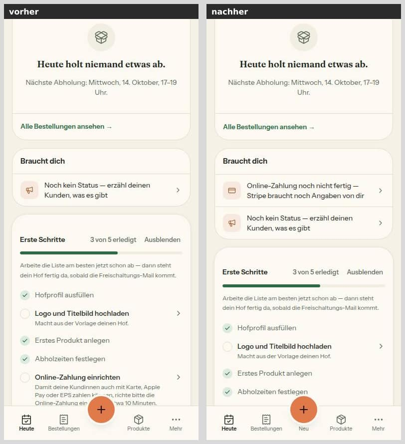
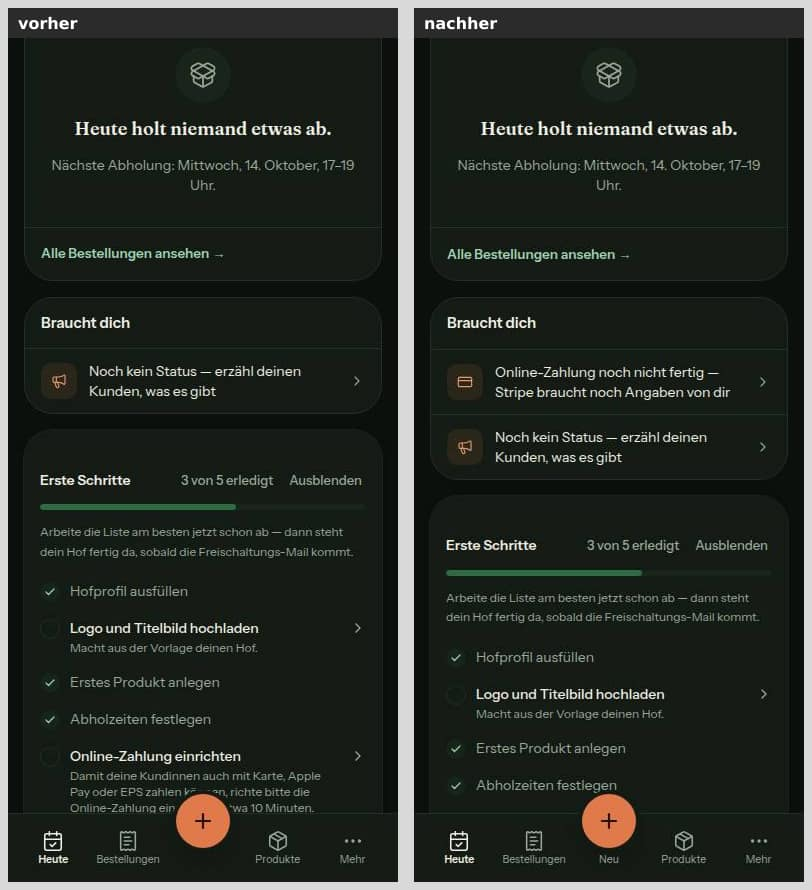

# Nr. 45 – Hofbereich kinderleicht

Enthält Migration: **nein** (keine Schema-Änderung, kein neues Paket, kein externer Dienst).

Branch `nacht/2026-10-08/45-hofbereich` von `main` (9c7da65). Freigabe: `freigabe.md` §12 „45" (Fassung `origin/docs/lauf8`). Berührte Register-Einträge: E10/E10a (Pflichttexte bleiben wörtlich), E11 (M3 nur für Altdaten), F6 (Wortlaut der Jahressumme), Z1 (Online-Zahlung einrichten).

## Was geändert wurde

**Heute (`/dashboard`)**
- `src/lib/heute.ts`: Die Regel `stripeHinweisOrt` legt fest, wo der Stripe-Hinweis steht. `heuteAufbau` lässt oben höchstens EINEN Kasten zu (nur Stripe) und setzt die Teilen-Zeile an jedem Tag direkt unter die Packliste. Neue Texte aus einer Quelle: `HEUTE_ABHOLEN`, `KENNZAHL_TEXT`, `HEUTE_NIEMAND` und die Zeile `STRIPE_BRAUCHT_DICH_TEXT`, die in „Braucht dich" vor allem anderen steht. `teilenKarte` entfällt.
- `src/lib/mein-hof.ts`: `hofBalkenArt` hält die Bedingung des Shell-Balkens („wartet auf Freischaltung" / „stillgelegt") an EINER Stelle, für Layout und Heute.
- `src/server/hofbereich.ts`: Das Layout nimmt den Balken aus `hofBalkenArt` (gleiches Ergebnis wie vorher).
- `src/server/queries/heute.ts`: `getHeute` berechnet `stripeOrt` und gibt die Stripe-Zeile an „Braucht dich" weiter, wenn schon der Balken der Shell oben steht.
- `src/components/heute/heute-teile.tsx`: Die Kennzahl kann einen Zusatz tragen („mit Hofladen"). Das Raster hat bis 1024 px zwei Spalten, der Betrag steht darunter über die ganze Breite. Die Teilen-Zeile gibt es nur noch kompakt (die große Karte entfällt). Die leere Packliste nutzt `HEUTE_NIEMAND`, die Stripe-Zeile hat ein eigenes Symbol.
- `src/app/(hof)/dashboard/page.tsx`: Der Aufbau kommt aus `heuteAufbau` mit dem Stripe-Ort; die Teilen-Zeile steht unter der Packliste; Hof-Adresse und `APP_URL` werden nicht mehr gebraucht.
- `src/app/(hof)/dashboard/loading.tsx`: Die Ladeansicht der Kennzahlen folgt dem neuen Raster (Höhen im Browser gemessen).

**Bestellungen (`/orders`)**
- `src/schemas/hof-bestellungen.ts`: Gültige Filterwerte sind `heute`, `offen` und `erledigt`. Jeder andere Wert fällt auf `offen` zurück (`.catch`).
- `src/lib/hof-bestellungen.ts`: Ordnet die drei Filter zu (`passtZumFilter`), baut die Chips mit Zahl und die Adressen (`bestellListeHref`, Standard ohne Parameter).
- `src/components/hof-bestellungen/bestellungen-ansicht.tsx`: Filterzeile mit drei Chips. Neue Leerzustände: bei „Heute abholen" (derselbe Satz wie die Packliste, Ausweg „Noch offene ansehen") und bei „Erledigt".
- `src/components/hof-bestellungen/bestellungen-laden.tsx`: Platzhalter für drei Chips.
- `src/components/hof-kunden/kunden-detail.tsx`: Der Link „N weitere Bestellungen" führt auf „Erledigt" statt auf das entfallene „Alle".

**Kunden (`/customers`)**
- `src/lib/hof-kunden.ts`: `sichtbareKundenFilter` (höchstens zwei), `SORTIEREN_TEXT` und `sortierungBeschreibung` für den Vorleser.
- `src/components/hof-kunden/kunden-sortieren.tsx` (neu): Knopf „Sortieren" (44 px, `aria-haspopup="dialog"`). Er öffnet ein Blatt, ab 768 px einen Dialog, mit zwei Radiogruppen („Sortieren nach", „Reihenfolge"). Erst „Übernehmen" schreibt die Adresse.
- `src/components/hof-kunden/kunden-ansicht.tsx`: Zeigt zwei Chips; `<select>` und Richtungsknopf sind durch `KundenSortieren` ersetzt.
- `src/components/hof-kunden/kunden-laden.tsx`: Ladeansicht mit zwei Chips und dem Knopf.

**Unterleiste**
- `src/lib/bauern-navigation.ts`: `HOF_NEU_KNOPF = 'Neu'`.
- `src/components/ui/bottom-nav.tsx`: Neue Variante „Mittelknopf mit Wort" (`mittelknopfMitWortKlassen`, `mittelkreisKlassen`); bestehende Klassen bleiben unverändert.
- `src/components/shells/hof-shell.tsx`: Plus und Wort „Neu" sind EIN Knopf (Trefferfläche 54 × 72 px); die Seitenleiste nimmt dasselbe Wort aus der Quelle.
- `src/app/intern/bausteine/bausteine-vorschau.tsx`: Die Vorschau zeigt die neue Variante.

**Fachwörter**
- `src/lib/futter-registrierung.ts`: Neu sind `USP_AUSGESCHRIEBEN` und der orange Satz „… Meldung beim BAES über das Unternehmensserviceportal (USP), keine Registrierung.". Dazu kommen `KENNZEICHNUNG_ERKLAERUNG` („Kennzeichnung heißt: …") und `KENNZEICHNUNG_FUNDORT`. Die E10a-Pflichttexte sind unverändert.
- `src/components/produkte/futter-formular.tsx`: Der Abschnitt „Kennzeichnung" beginnt mit dem erklärenden Satz.
- `src/components/products/product-dialog.tsx`: Derselbe Satz steht im Bearbeiten-Dialog. Die Rückfrage heißt „Futter-Angaben löschen?" und spricht von den „Angaben vom Sackanhänger".
- `src/components/products/kategorie-sheet.tsx`: „Angaben vom Sackanhänger" statt „Kennzeichnung".
- `src/schemas/product.ts`: Die Meldung beim Kategorie-Wechsel kommt ohne das Fachwort aus (`FUTTER_FEHLER` unverändert).
- `src/lib/taxonomie.ts`: Der Betriebsstatus heißt „Eigene Ernte (Primärproduktion)" (Hofprofil und Einstellungen).
- `src/lib/hof-verkaeufe.ts`: `UMSATZGRENZE_ERKLAERUNG` nennt den Betrag der Grenze aus `PROCESSING_REVENUE_LIMIT` (dieselbe Quelle wie die Jahreskarte der Auswertung); `JAHRESSUMME_TEXT` bleibt wie F6.
- `src/components/hof-verkaeufe/verkaeufe-ansicht.tsx`: Zeigt den Satz leise unter „Dieses Jahr (für die Umsatzgrenze): …".
- `docs/mockups/mobil-h2-neues-futter-meldung-fehlt.html`, `docs/mockups/web-h2-neues-futter.html`: USP ist ausgeschrieben („über das Unternehmensserviceportal (USP)").

**Tests**
- `tests/heute-seite.test.ts`: Prüft Aufbau (ein Kasten oben, Teilen unter der Packliste), Stripe-Ort, Balken-Regel, Kennzahl-Texte und die Teilen-Zeile.
- `tests/heute.test.ts`: Die Stripe-Zeile steht vor allem anderen; die Fixtures haben das Feld `stripe` dazubekommen.
- `tests/hof-bestellungen.test.ts`: Prüft die drei Filter, die Aufteilung (jeder Status gehört genau zu „noch offen" oder zu „erledigt"), die Adressen, alte Werte, die gerenderte Filterzeile und die Leerzustände.
- `tests/hof-kunden.test.ts`: Prüft den Knopf „Sortieren", die Radiogruppen, höchstens zwei Chips und den Vorlesetext.
- `tests/unterleiste-neu.test.ts` (neu): Das Wort kommt aus der Quelle und steht im Knopf des Plus, die Trefferfläche wird nicht kleiner, die Seitenleiste nennt dasselbe Wort.
- `tests/fachwort-wache.test.ts` (neu): Durchsucht jede Zeichenkette, Vorlage und jeden JSX-Text unter `src/` nach den vier Wörtern, mit Gegenproben.
- `tests/bausteine.test.ts`: Neuer Fall „BottomNav: Mittelknopf mit Wort".
- `tests/futter-registrierung.test.ts`, `tests/baes-kontakt.test.ts`: Der orange Satz enthält das ausgeschriebene USP, sonst steht nirgends „USP".
- `tests/hof-einstellungen.test.ts`, `tests/integration/einstellungen.int.test.ts`: Erwarten „Eigene Ernte (Primärproduktion) · …".
- `tests/hof-verkaeufe.test.ts`: Der Satz steht unter der Jahressumme.

Zuerst rot, dann grün:
- `heute-seite`: 10 von 64 rot.
- `hof-bestellungen`: 8 von 28 rot.
- `hof-kunden`: rot, weil das Modul fehlte.
- `unterleiste-neu`: 4 von 5 rot.
- `fachwort-wache`: 4 von 7 rot; später noch einmal rot für den Betrag in der Erklärung.

## Was nicht gelöst wurde und warum

- **Brennholz-Zahl aus der Produktion:** Kein Lauf darf an die Produktion. Die nur lesende Abfrage für den Menschen steht unten, lokal ergibt sie nur ein Beispiel.
- **„Kennzeichnung" bleibt außerhalb des Hofbereichs:**
  - auf der Produktseite der Kundin (aufklappbarer Abschnitt, Kundensicht ist Nr. 46);
  - im Impressum (Rechtstext);
  - in der Admin-Länderliste;
  - in den wörtlichen E10a-Pflichttexten, die der Satz davor erklärt.

  Die Wache führt diese Stellen in einer Liste mit Grund.
- **Ohne eigenes Bild:** Bearbeiten-Dialog (`product-dialog.tsx`), Kategorie-Blatt und Schema-Meldung. Dort steht dasselbe wie im Bild „Kennzeichnung" bzw. dieselbe Wendung „Angaben vom Sackanhänger". Auch der Leerzustand „Heute abholen" in Bestellungen hat kein Bild; Axe ist dort geprüft.
- **Unterleiste bei 1440 px:** Die gibt es im Browser nicht. Die Seitenleiste zeigt „Neu" unverändert, darum nur Bilder bei 390 px.
- **Kunden-Filter „Diesen Monat", „Lange weg" und „Neu"** stehen nicht mehr als Chips da. Sie gelten weiter über die Adresse und den Tipp „Diese Kunden ansehen"; ihre Zahl sieht man nur noch, wenn der Filter gewählt ist.
- **`tester` und `pruefer`** liefen nicht aus dieser Sitzung (kein Subagent-Werkzeug hier). Selbst geprüft wurden Lint, Axe, Tastatur, beide Themes und Bilder. Abhaken macht der Dirigent.
- **Integration:**
  - Gesamtlauf auf dem Stand vor der letzten Textänderung: 36 Dateien, 328 Tests. Ein Fehler trat unter Last auf, in `bargebuehr.int.test.ts` (der Mail-Nachlauf war noch nicht aufgerufen). Die Datei läuft einzeln grün, und diese Nummer berührt sie nicht.
  - Nach der letzten Änderung liefen `einstellungen`, `futter-familie` und `verkauf-vorrat` grün (3 Dateien, 21 Tests).

## Annahmen

- **„Höchstens ein Hinweis-Kasten oben" zählt den Balken der Shell mit.** Freigeschaltete Höfe sehen oben nur den Stripe-Hinweis („einrichten" oder „pausiert", nie beide), wie bisher. Ein Hof, der auf die Freischaltung wartet oder stillgelegt ist und Stripe angefangen hat, sah bisher den Balken UND „Online-Zahlung ist pausiert" übereinander. Bei neuen Höfen ist das häufig, weil `acceptsOnline` standardmäßig an ist. Den Balken des Layouts kann die Seite nicht verdrängen. Darum wird der Stripe-Hinweis dann die erste Zeile von „Braucht dich" („Online-Zahlung noch nicht fertig — Stripe braucht noch Angaben von dir", Ziel `/settings/payments`). Der Satz „Bis dahin können Kunden bei dir nicht bestellen" fällt dort weg, denn ein wartender Hof nimmt ohnehin noch keine Bestellungen an.
- **Teilen:** An jedem Tag steht dieselbe kompakte Zeile unter der Packliste, auch an Tagen ohne Abholung. Die große Karte der Seitenspalte entfällt; ihre Hof-Adresse steht weiter im Kopf von Mein Hof und im Teilen-Fenster.
- **„Umsatz heute":** Gewählt ist die erste Variante der Freigabe: „Heute eingenommen" mit dem Zusatz „mit Hofladen". Direktverkäufe sind nicht getrennt; die Rechnung bleibt `umsatzHeuteCent`. „Bestellungen heute" heißt jetzt „Heute abholen", dasselbe Wort wie der Filter in Bestellungen. So bezieht sich die „0" sichtbar auf offene Abholungen, nicht auf das Geld.
- **Bestellungen:**
  - „Heute abholen" zeigt Bestellungen, die noch offen sind und deren Abholtag heute (Wien) ist. Das sind dieselben wie in der Packliste, auch „wartet auf Kunde".
  - „Noch offen" zeigt alles, wo noch etwas zu tun ist, auch Überfälliges. Das ist der Standard, wie vorher „Offen".
  - „Erledigt" zeigt Abgeholtes, Storniertes und nicht Abgeholtes.
  - Zugeordnet wird beim Lesen, nachdem die Seite Verwaistes freigegeben hat. Alte Lesezeichen („Zum Packen", „Gepackt", „Alle") fallen still auf „Noch offen".
- **Kunden:**
  - Sichtbar sind „Alle" und „Stammkunden". Ist ein anderer Filter gewählt, steht er an der Stelle von „Stammkunden".
  - Eine neue Sortierung setzt die Reihenfolge auf deren Standard zurück (z. B. Name → A bis Z).
  - „Abbrechen" und Escape ändern nichts.
- **Fachwörter:**
  - „Primärproduktion" bleibt in Klammern hinter „Eigene Ernte", damit der Hof das Amtswort auf Formularen wiedererkennt.
  - „Umsatzgrenze" bleibt im F6-Wortlaut. Der Satz darunter nennt den Betrag (55.000 € aus `PROCESSING_REVENUE_LIMIT`, so vereinfacht wie die Auswertung, „keine Steuerberatung"). Die erste Fassung „Bis zu dieser Summe …" las sich direkt unter der Jahressumme wie deren Betrag.
  - „Kennzeichnung" wird im Abschnitt erklärt, sonst steht „Angaben vom Sackanhänger" da.
- **Brennholz:** Die Abfrage gibt je Hof die interne Hof-ID aus, keine Namen. Das Ergebnis gehört nicht ins Repository.

## Bilder (vorher/nachher)

Alle Bilder stammen aus der lokalen Test-DB mit erfundenen Seed-Daten. Für „0 neben € 178" kamen kurz eine abgeholte Bestellung und ein Hofladen-Verkauf dazu. Für den wartenden Hof war in `hof-wartend` kurz eine Platzhalter-Stripe-Kennung gesetzt. Beides ist wieder entfernt. Vorher-Bilder stammen vom gemeinsamen main-Server (:3005), nachher-Bilder vom eigenen Server (:3105). 46 Bilder, zusammen 2,4 MB.

**Heute, freigeschalteter Hof ohne Stripe:** Oben steht nur noch der Stripe-Kasten. Die Kennzahlen lauten „Heute abholen 0 · Noch zu packen 0 · Heute eingenommen € 178,00 mit Hofladen"; vorher wurde der Betrag zu „€ 178,…" gekürzt.


**Heute, Teilen-Zeile unter der Packliste:**


**Heute, Hof wartet auf Freischaltung und hat Stripe angefangen:** Vorher standen Balken und Kasten übereinander, nachher steht nur der Balken oben, die Stripe-Zeile ist in „Braucht dich".






**Bestellungen:** Vorher Offen · Heute · Zum Packen · Gepackt · Erledigt · Alle, nachher Heute abholen · Noch offen · Erledigt.


**Kunden:** zwei Chips und der Knopf „Sortieren". Das Blatt bzw. der Dialog ist rechts mit dem alten Stand links verglichen.


**Unterleiste:** „Neu" unter dem Plus.


**Verkäufe:** Satz zur Umsatzgrenze unter der Jahressumme.


**Einstellungen und Hofprofil:** „Eigene Ernte (Primärproduktion)".


**Neues Futtermittel:** oranger Satz mit ausgeschriebenem USP; der Abschnitt „Kennzeichnung" beginnt mit dem erklärenden Satz.


## Mockup-Abweichungen — bitte freigeben

1. **Heute, Teilen** (web-/mobil-h3-heute-mit-teilen-karte): An Abholtagen stand die Teilen-Zeile oben, an anderen Tagen gab es die große Karte in der Seitenspalte. Jetzt steht an jedem Tag die kompakte Zeile unter der Packliste (wie §12 beschreibt). Bilder: „Heute Teilen 390", „Heute 1440".
2. **Heute, Kennzahlen** (h3-heute-*, system-heute-hell): Statt „Bestellungen heute" steht jetzt „Heute abholen", statt „Umsatz heute" jetzt „Heute eingenommen" mit dem Zusatz „mit Hofladen" (§12). **Nicht in §12 beschrieben und darum eigens zur Freigabe:** Unter 1024 px stehen die Kennzahlen 2 + 1 statt drei nebeneinander. Mit dem längeren Wort kürzten drei schmale Spalten den Betrag zu „€ 178,…" (vorher schon so; siehe „Heute 390", links). Ab 1024 px bleiben es drei nebeneinander.
3. **Heute, Online-Zahlung pausiert** (h3-heute-online-zahlung-pausiert): Für freigeschaltete Höfe ändert sich nichts. Für wartende oder stillgelegte Höfe zeigt das Mockup den Zustand nicht. Dort steht der Hinweis als Zeile in „Braucht dich" (Annahme oben). Bilder: „Heute wartend".
4. **Bestellungen** (mobil-h3-bestellungen, web-h3-bestellungen-packen-uebergeben): genau drei Filter statt Heute, Zum Packen, Gepackt und Abgeholt (§12). Die Marken „Zum Packen"/„Gepackt" in den Zeilen und die Kopfzeile „N offen · M gepackt" bleiben. Bilder: „Bestellungen".
5. **Unterleiste** (alle mobilen Hof-Mockups ohne Wort unter dem Plus): „Neu" unter dem Plus (§12). Bild: „Unterleiste".
6. **Kunden:** Dafür gibt es kein Mockup (22a). Gebaut nach DESIGN_SYSTEM: Knopf „Sortieren" mit Blatt bzw. Dialog, zwei Radiogruppen, „Übernehmen" grün. Bilder: „Kunden", „Kunden Sortieren".
7. **Mockups geändert, wie §12 verlangt:** In mobil-h2-neues-futter-meldung-fehlt und web-h2-neues-futter ist USP ausgeschrieben. Die App sagt jetzt dasselbe wie diese Mockups (Nr. 36 hatte das Kürzel in der App gestrichen). Bilder: „Futter Registrierung".

## Wie der Mensch es testet

Anmelden als Hof (Vorschau oder lokal mit den Seed-Konten `bauer-b@example.com`, `bauer-a@example.com`, `bauer-d@example.com`).

1. **Heute** `/dashboard` (freigeschalteter Hof ohne Stripe):
   - Erwartung: Oben steht genau ein Kasten, „Online-Zahlung einrichten".
   - Ist der Hof sichtbar, steht die orange Zeile „Diese Woche bei dir: … Teilen" direkt unter der Packliste, an jedem Tag.
   - Am Handy stehen zwei Kennzahlen nebeneinander, darunter „Heute eingenommen" über die ganze Breite.
2. **„0 neben € 178":**
   - An einem Abholtag eine Bestellung als abgeholt markieren und unter Verkäufe einen Hofladen-Verkauf eintragen.
   - Erwartung: „Heute abholen 0", „Heute eingenommen € …" mit „mit Hofladen", der Betrag ungekürzt.
3. **Wartender Hof mit angefangenem Stripe:**
   - Neuen Hof registrieren, unter Einstellungen → Zahlung die Einrichtung beginnen und abbrechen.
   - Erwartung auf `/dashboard`: Oben steht nur der Balken „Dein Hof wird noch geprüft …".
   - In „Braucht dich" steht zuerst „Online-Zahlung noch nicht fertig — Stripe braucht noch Angaben von dir"; ein Tipp führt zu `/settings/payments`.
4. **Bestellungen:**
   - `/orders`: Erwartung sind die Chips „Heute abholen · N", „Noch offen · N" (gewählt) und „Erledigt".
   - `/orders?filter=heute` an einem Tag ohne Abholung: Erwartung ist „Heute holt niemand etwas ab." mit dem Ausweg „Noch offene ansehen".
   - `/orders?filter=alle` (altes Lesezeichen): Erwartung ist „Noch offen".
   - Im Kundendetail führt „N weitere Bestellungen" auf „Erledigt".
5. **Kunden:**
   - `/customers`: Erwartung sind nur „Alle" und „Stammkunden".
   - „Sortieren" antippen: Am Handy öffnet sich ein Blatt, ab 768 px ein Dialog.
   - „Name" wählen und „Übernehmen": Erwartung ist die Adresse `?sortierung=name` und die Liste von A bis Z.
   - Noch einmal öffnen und Escape drücken: Nichts ändert sich, der Fokus steht wieder auf dem Knopf.
   - `/customers?filter=lange`: Erwartung sind die Chips „Alle" und „Lange weg".
6. **Unterleiste** (390 px): „Neu" steht unter dem Plus. Wort und Kreis öffnen dasselbe Blatt „Was legst du an?".
7. **Fachwörter:**
   - `/sales`: Unter „Dieses Jahr (für die Umsatzgrenze): …" steht „Umsatzgrenze heißt: Bis € 55 000 im Jahr …".
   - `/settings` und `/settings/profile`: „Eigene Ernte (Primärproduktion)".
   - `/products?neu=1&bereich=futter`: Der orange Satz nennt das „Unternehmensserviceportal (USP)". Der Abschnitt „Kennzeichnung" beginnt mit „Kennzeichnung heißt: …". Der Bestätigungshaken (E10a) ist wortgleich wie vorher.

Geprüft im Browser (agent-browser, Test-DB):
- **Axe:** 0 Verstöße in 20 Prüfungen: Heute, Bestellungen, Bestellungen „Heute abholen", Kunden und Kunden mit offenem „Sortieren", je bei 390 und 1440 px, hell und dunkel. Unvollständig blieben nur zwei bekannte Muster: `color-contrast` auf Heute 390 (von der Unterleiste überdeckt) und `aria-hidden-focus` unter dem offenen Dialog (wie 22b/39).
- **Touch-Ziele:** alle ≥ 44 px. „Neu" hat 54 × 72 px, das Wort steht auf der Höhe der übrigen Beschriftungen. „Sortieren", die Chips und die Radiozeilen sind ≥ 44 px.
- **Tastatur:** Der Fokus springt in die gewählte Option, Pfeiltasten wechseln, Escape schließt, der Fokus kehrt zum Knopf zurück.

## Brennholz in m³ (Auftrag: Anzahl je Hof, ohne Namen)

Aus diesem Lauf heraus nicht zählbar, denn kein Lauf darf an die Produktion. Für den Menschen gibt es dafür eine nur lesende Abfrage, etwa im SQL-Editor von Supabase. Sie gibt die interne Hof-ID aus, keine Namen; das Ergebnis gehört nicht ins Repository:

```sql
SELECT p."farmId"                                        AS hof_id,
       count(*)                                          AS produkte_m3,
       count(DISTINCT coalesce(p."familieId", p.id))     AS karten_m3,
       count(*) FILTER (WHERE p.category = 'BRENNHOLZ')  AS davon_brennmaterial,
       count(*) FILTER (WHERE p."isAvailable")           AS davon_im_shop,
       bool_or(f."archivedAt" IS NOT NULL)               AS hof_stillgelegt
FROM "Product" p
JOIN "Farm" f ON f.id = p."farmId"
WHERE p.unit = 'M3'
GROUP BY p."farmId"
ORDER BY produkte_m3 DESC;
```

- `produkte_m3` zählt jede Größe einzeln, `karten_m3` die Karten auf der Hofseite (Größen einer Familie zählen einmal).
- **Lokale Test-DB, nur als Beispiel:** 1 Hof mit 1 Produkt in m³ (Brennmaterial, im Shop).
- **Hinweis rm/srm (Register E11):** M3 ist für Holz mehrdeutig und bleibt nur für Altdaten. Für Brennholz und Anzündholz ist **Raummeter (rm)** gedacht (1 m³ ordentlich gestapelt), für Hackschnitzel und lose geschüttetes Holz **Schüttraummeter (srm)**. Beide sind im Formular „Neues Brennmaterial" wählbar.
- **Daten ändert der Hof selbst** in seinem Produkt. Kein Lauf stellt Einheiten um, und die Abfrage schreibt nichts.

## Angepasste `.md`

- `docs/ai/DESIGN_SYSTEM.md`:
  - Bausteine: BottomNav-Variante mit Wort.
  - Neue Regel „Fachwörter im Hofbereich".
  - Unterleiste Hof mit „Neu".
  - Heute: ein Kasten oben, Kennzahlen, Teilen-Zeile, Ort des Stripe-Hinweises.
  - Bestellungen: drei Filter und Leerzustände.
  - Kunden: zwei Filter und „Sortieren".
  - Verkäufe: Satz zur Umsatzgrenze mit Betrag.
  - Abschnitt „Kennzeichnung".
- `docs/ai/ARCHITECTURE.md`: `hofBalkenArt` im Hofbereich, drei Filter in Bestellungen, `stripeHinweisOrt` statt `teilenKarte` in den Heute-Absätzen.
- `DEVELOPMENT.md`: Abschnitt „Hofbereich kinderleicht (Nachtlauf Nr. 45, Oktober 2026)" mit Begründungen und Verlauf.
- `docs/mockups/mobil-h2-neues-futter-meldung-fehlt.html`, `docs/mockups/web-h2-neues-futter.html`: USP ausgeschrieben.
- `docs/nachtlauf/berichte/45.md`: dieser Bericht.

## Checkliste §3

- [x] Register und Freigabe decken den Inhalt ab (§12 „45"; E10a wörtlich, F6, E11, Z1)
- [ ] `origin/main` vor dem Push hineingeholt: Push und PR macht der Dirigent (Basis 9c7da65)
- [x] `pnpm typecheck` grün. `pnpm lint` ohne neuen Befund (13 Fehler / 7 Warnungen wie `main`; in den geänderten Dateien nur die bekannten 3 Fehler und 1 Warnung in `product-dialog.tsx`, um 2 Zeilen verschoben). `pnpm test` grün: 288 Dateien / 5.486 Tests (Grundlinie 286 / 5.456)
- [x] `pnpm test:integration`: Die Datenbank wird nur lesend wie bisher berührt (keine neue Abfrage, die schreibt). Gesamtlauf 36 / 328 mit 1 Lastfehler in einer fremden Datei (einzeln grün); betroffene Dateien 3 / 21 grün
- [x] Migration: nein
- [x] Geld nur als Int-Cent, Beträge nur serverseitig: an der Rechnung nichts geändert (`umsatzHeuteCent` unverändert)
- [x] Keine Personendaten oder Secrets in Code, Logs, Tests (Bilder nur Seed-Daten)
- [x] Bilder 390 und 1440 px vorher/nachher, beide Themes, im Bericht (Unterleiste nur 390 px, im Browser gibt es sie nicht)
- [x] Axe ohne Fehler, Touch-Ziele ≥ 44 px; keine neue Seite, Ladeansichten angepasst
- [x] Texte aus einer Quelle (`heute.ts`, `hof-bestellungen.ts`, `hof-kunden.ts`, `bauern-navigation.ts`, `futter-registrierung.ts`, `hof-verkaeufe.ts`, `taxonomie.ts`), Deutsch, per Du
- [ ] tester und pruefer gelaufen, Befunde erledigt oder begründet
- [x] Kein Entwurf nötig, keine Vorbedingung offen
