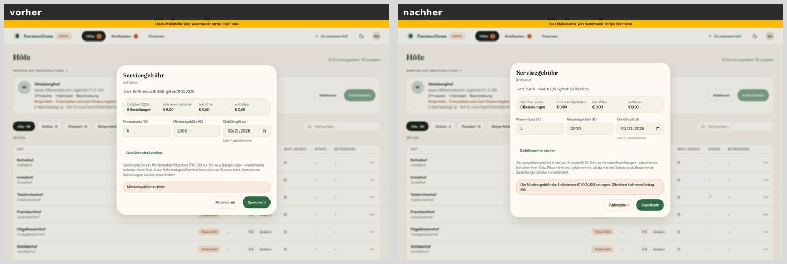
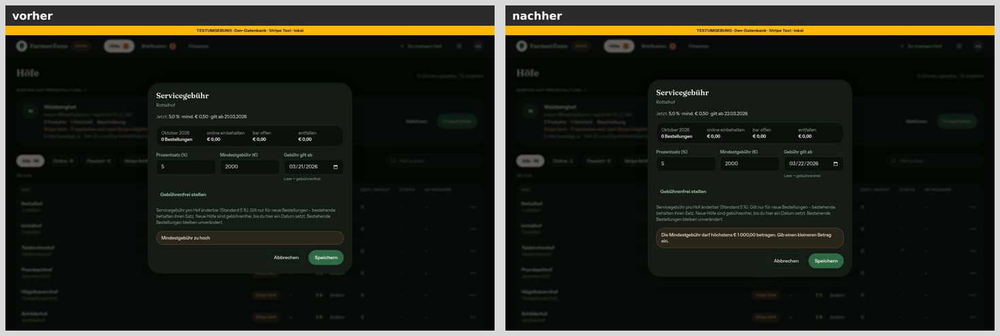
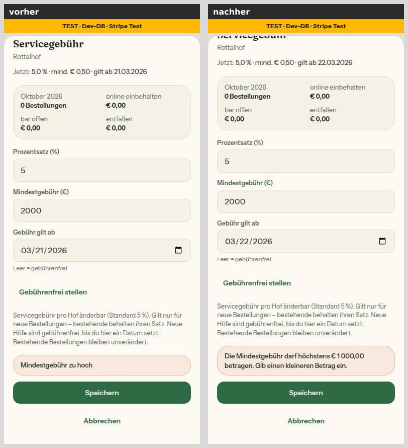
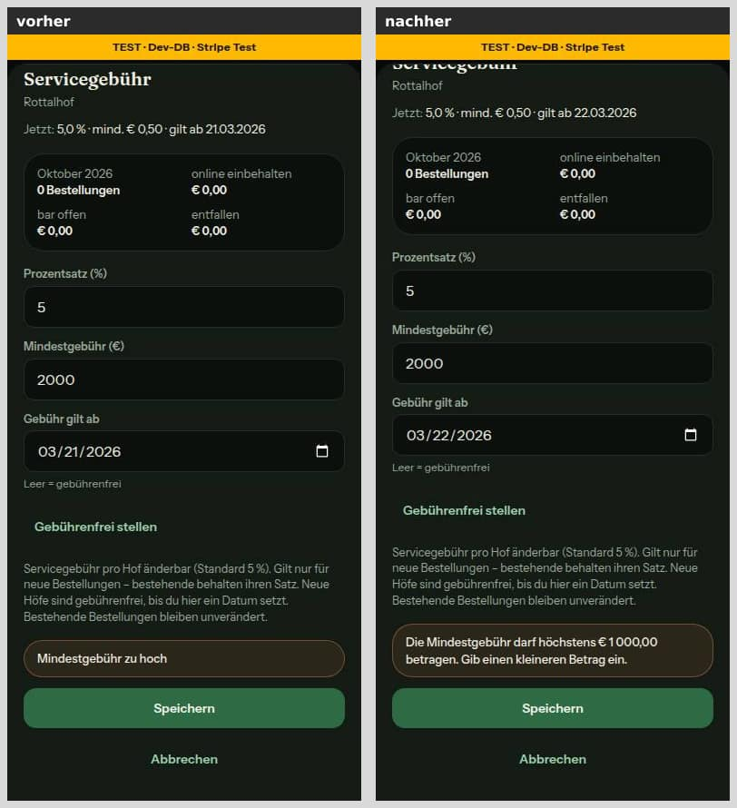

# Bericht Nr. 47 — Altlasten aus Lauf 7 und Laufzeit-Befunde (Sicherheitspfad)

Enthält Migration: **nein** (keine Schema-Änderung, kein neues Paket).

Branch `nacht/2026-10-08/47-altlasten`, Basis `origin/main` 9c7da65. Freigabe: `freigabe.md` §12 „47".

## Die zwei Laufzeit-Befunde in einem Satz

- **Warnung auf der Kasse:** Seitentitel und Seite haben den Hof getrennt geladen. Prisma hat beide Abfragen manchmal in eine Transaktion gebündelt und darin gleichzeitig über dieselbe Verbindung geschickt. Jetzt lädt die Kasse den Hof einmal je Aufruf.
- **/hoefe beim Neubau:** Der Verbindungs-Pooler hat die Anmeldung gelegentlich nicht rechtzeitig geschafft („EAUTHTIMEOUT"). Die öffentliche Hofliste versucht es jetzt genau einmal nach 0,3 Sekunden neu und meldet erst, wenn auch das scheitert.

### Befund Kasse im Detail

- Ein `Promise.all` mit dem Transaktions-Client gibt es im Code nicht. Prisma 7.8 reiht Aufrufe auf einer Transaktion ohnehin selbst nacheinander ein (gemessen).
- Gefunden mit einer Hülle um `pg.Client.prototype.query` am lokalen Dev-Server (nur lokal, nicht im Code). Sie hat jede Abfrage innerhalb einer Transaktion protokolliert.
- Ergebnis beim Öffnen der Kasse: eine Transaktion mit zweimal derselben Abfragefolge (Hof, Werte, Fotos, Produkte, Abholzeiten, Futter, Brennmaterial). Darin liefen jeweils drei bis vier Teilabfragen gleichzeitig.
- Ursache: `generateMetadata` und die Seite riefen beide `getPublicFarm` auf. Liegen die zwei Aufrufe im selben Takt, bündelt Prisma sie. Wegen `approvedAt: { not: null }` lassen sie sich nicht zu einer Abfrage zusammenlegen, also läuft der Batch in einer Transaktion. Darin startet Prisma die Teilabfragen der Relationen gleichzeitig.
- pg warnt ab der dritten gleichzeitigen Abfrage auf einer Verbindung. In pg@9 wird daraus ein Fehler, dann bräche die Kasse.
- Nur im selben Takt — deshalb kam die Warnung nur gelegentlich.
- Gemessen am Dev-Server: vorher zwei Hof-Abfragen je Aufruf, nachher eine und keine Transaktion (je vier Aufrufe).
- Die übrigen öffentlichen Seiten, der Hofbereich und der Admin zeigten mit derselben Hülle nichts Gleichzeitiges.

### Befund /hoefe im Detail

- Der Pooler meldet den Anmelde-Zeitablauf als FATAL mit SQLSTATE 08006.
- Prisma 7 reicht das mit dem pg-Adapter als `DriverAdapterError` durch: `cause = { kind: 'postgres', originalCode: '08006', originalMessage: '(EAUTHTIMEOUT) …' }`. Nachgestellt und gemessen mit einem echten pg-Fehler.
- Beim Neubau im Hintergrund schreibt `unstable_cache` einen Fehler nur ins Log. Deshalb meldet der Wiederhol-Helfer selbst an Sentry, wenn auch die Wiederholung scheitert.

## Was geändert wurde (je Datei ein Satz)

**Servicegebühr**
- `src/schemas/servicegebuehr.ts`: Die vier Sätze zur Mindestgebühr sind geduzt, enden mit einem Punkt und nennen einen Ausweg. „Zu hoch" nennt die Grenze aus `MINDESTGEBUEHR_MAX_CENTS`, über `formatEuro`.
- `src/lib/admin-hoefe.ts`: `MINDESTGEBUEHR_UNGUELTIG` ist jetzt derselbe Satz wie der des Servers (eine Quelle).

**Double-Opt-in**
- `src/server/abo-anmeldung.ts`: `loeseOffeneAnfrageAuf` hat den Rückgabetyp `Prisma.PrismaPromise<Prisma.BatchPayload>`, mit JSDoc „verzögert". Neu ist `meldeAboMitTokenAb`: Abmelden mit dem signierten Token, dieselbe Funktion für den Knopf und für die Ein-Klick-Abmeldung.
- `tests/abo-bestaetigung-quelltext.test.ts`: Die Wache liest den Quelltext über den TypeScript-Parser.
  - Gemeldet wird jedes `optInEmail` mit einem Wert außer `false` in `data`/`create`/`update`, außer in `bestaetigeEmailAbo`.
  - Ebenso jedes `true` außerhalb von Lese-Auswahlen und der zwei erlaubten Konstanten.
  - Jeder Aufruf von `loeseOffeneAnfrageAuf` muss abgewartet werden, in `$transaction([...])` stehen oder zurückgegeben werden.
  - Mit Gegenproben genau für das, was die alte Zeilen-Wache durchließ.

**Sentry**
- `src/lib/sentry-hygiene.ts`: `bereinigeEreignis` bereinigt jetzt auch:
  - `logentry` (Nachricht und Parameter), `tags`, `extra` und die Daten der Brotkrumen vollständig,
  - alle Kontexte außer den technischen des SDK (`UNBEDENKLICHE_KONTEXTE`, siehe Annahmen).
  - Heikle Schlüssel fallen weg. Texte gehen durch `bereinigeFreitext`: E-Mail, Telefon, Code, Adressen mit Token, „token=…", „Bearer …", Kennungen ab 32 Zeichen, IPv4 und IPv6.
  - `frame.vars` fallen ganz weg, in Ausnahmen und Threads.
- `tests/sentry-hygiene-felder.test.ts` (neu): je Feld ein Test mit E-Mail, Token und IP darin, dazu Gegenproben (Kennungen, Codes, Uhrzeiten, Browser-Version „120.0.0.0") und verquere Gestalten.

**Bremse**
- `src/lib/bremse-datenbank.ts`: `BREMSE_MELDE_ABSTAND_MS` (10 Minuten) und die reine Regel `bremsMeldungFaellig`.
- `src/server/bremse-datenbank.ts`: Bei Datenbankfehler oder Zeitlimit meldet die zweite Stufe höchstens einmal je Instanz und 10 Minuten (Modul-Zustand). Die nächste Meldung nennt die unterdrückten (`unterdruecktSeitLetzterMeldung`). Fail-open bleibt.
- `tests/bremse-datenbank.test.ts`: Regel, Dauerausfall, Wiedermeldung nach 10 Minuten mit Zähler, gemeinsame Bremse für Zeitlimit und Fehler, zwei Instanzen, Verdrahtung mit dem Modul-Zustand. Die Zeit steckt jeweils im Parameter.

**Kasse**
- `src/server/queries/farm.ts`: Neu ist `getPublicFarmGeteilt`, `getPublicFarm` einmal je Anfrage (React `cache`), mit Begründung.
- `src/app/(public)/[farmSlug]/checkout/page.tsx`: Metadaten und Seite laden den Hof über `getPublicFarmGeteilt`.
- `tests/transaktion-nacheinander.test.ts` (neu), zwei Wachen mit Gegenproben:
  - kein `Promise.all`/`allSettled`/`race`/`any` mit dem Transaktions-Client (Rückruf von `$transaction` oder Parameter vom Typ `TransactionClient`, auch über einen Typ-Alias);
  - keine Seite mit `generateMetadata` ruft dieselbe Server-Abfrage zweimal ungeteilt auf.
- `tests/integration/kasse-lesepfad.int.test.ts` (neu): Gegen echtes Postgres laufen zweimal `getPublicFarm` im selben Takt in einer Transaktion gleichzeitig über eine Verbindung. Einmal geladen und nacheinander geladen läuft nichts gleichzeitig.

**/hoefe**
- `src/lib/verbindungsfehler.ts` (neu): Erkennung `istVerbindungsabbruch` (08006 oder EAUTHTIMEOUT, auch unter `meta.driverAdapterError`), `verbindungsUrsache` für die Meldung, `WIEDERHOLUNG_PAUSE_MS` = 300.
- `src/server/oeffentlich-lesen.ts` (neu): `leseOeffentlichMitWiederholung` versucht genau einmal neu und meldet nur, wenn auch die Wiederholung scheitert (ohne Personendaten, Rohtext nur bereinigt). `schonGemeldet` verhindert eine Doppelmeldung.
- `src/server/queries/oeffentliche-hoefe.ts`: Die gecachte Hofliste liest über den Helfer.
- `src/app/(public)/hoefe/page.tsx`, `src/app/page.tsx`: Einen schon gemeldeten Abbruch melden sie nicht ein zweites Mal.
- `tests/oeffentlich-lesen.test.ts` (neu): Erkennung, ein Versuch bzw. eine Wiederholung, nie ein dritter Versuch, Meldung, Wache.
  - Die Wache prüft: nur die öffentliche Hofliste darf wiederholen, der Rückruf schreibt nicht, nicht in einer Transaktion, `getOeffentlicheHoefe` liest nur.
- `tests/integration/oeffentlich-lesen.int.test.ts` (neu): gegen echtes Postgres, der pg-Pool scheitert auf Wunsch mit 08006.
  - Ein Abbruch: Die Liste kommt vollständig, ohne Meldung.
  - Zwei Abbrüche: eine Meldung, der Fehler geht weiter.
  - Gegen die alte Fassung ohne Wiederholung: rot.

**Ein-Klick-Abmeldung**
- `src/lib/abmelde-link.ts` (neu): beide Pfade, `listUnsubscribeKoepfe` und die Sätze des Endpunkts aus einer Quelle.
- `src/schemas/abmelden.ts` (neu): Token-Gestalt und Inhalt des Ein-Klick-POST („List-Unsubscribe=One-Click").
- `src/app/api/abmelden/route.ts` (neu):
  - POST meldet mit gültigem Token ab: gebremst, nur als Formular, idempotent, dieselbe Antwort mit und ohne Abo. Ein ungültiger Token ist 400.
  - GET ändert nichts und leitet (303) auf die Seite mit dem Knopf.
- `src/lib/email.ts`: `sendRaw` nimmt optionale Kopfzeilen. `sendStatusUpdateEmail` bekommt den Token und baut daraus den Link und `List-Unsubscribe` + `List-Unsubscribe-Post`. Keine andere Mail trägt sie.
- `src/server/actions/status-posts.ts`: übergibt den Token statt einer fertigen Adresse.
- `src/server/actions/subscriptions.ts`: `unsubscribeWithToken` prüft das Argument mit Zod und nutzt `meldeAboMitTokenAb`.
- `next.config.ts`: `/api/abmelden` ohne Referrer und ohne Suchindex.
- `tests/abmelde-link.test.ts`, `tests/abmelden-route.test.ts` (neu), `tests/abo-bestaetigung-mail.test.ts`: Die Kopfzeilen stehen an der werblichen Mail, aber an keiner Transaktionsmail. Dazu eine Wache, dass `email.ts` sie nur in `sendStatusUpdateEmail` setzt.
- `tests/integration/abmelden.int.test.ts` (neu): Zustand in Postgres nach POST (E-Mail und WhatsApp aus, offene Anfrage aufgelöst, anderes Abo bleibt) nach zweimal, ohne Abo, nach falschem Token und nach GET.
- `tests/integration/double-opt-in.int.test.ts`, `tests/sicherheits-header.test.ts`: an den Token-Parameter bzw. die neue Route angepasst.

**Bericht**
- `docs/nachtlauf/berichte/bilder/47/*.jpg`: vier Bildpaare des Servicegebühr-Dialogs.

## Was nicht gelöst wurde und warum

- **Fehlertext und Ausnahme in Sentry:** Dort bleiben IP-Adressen stehen (Entscheidung aus Nr. 37: Dort steht die Adresse unseres Datenbank-Servers). Auch ein Token in einer relativen Adresse bleibt dort stehen („Link /reset-password?token=…", ein bestehender Test hält das so fest). Nicht in §12. Vorschlag: `message` und `exception.value` zusätzlich durch die Token-Regeln von `bereinigeFreitext` schicken (ohne IP).
- **Dateinamen in Stack-Frames:** Bei Skripten, die direkt in die Seite eingebettet sind, ist der Dateiname eines Frames im Browser die Seitenadresse. Bei `/<hof>/bestaetigen/<token>` stünde dort der Token. Nicht in §12. Eine Änderung an `filename`/`abs_path` könnte die Zuordnung der Quelltext-Karten stören. Vorschlag für einen späteren Lauf.
- **Batch über zwei Anfragen hinweg:** Prisma bündelt `findUnique` im selben Takt über den ganzen Client, theoretisch auch aus zwei gleichzeitigen Anfragen derselben Instanz. `cache` hilft nur innerhalb einer Anfrage. Nicht beobachtet, aber vor einem Umstieg auf pg@9 zu prüfen. Möglicher Weg wäre `relationLoadStrategy: 'join'` für `getPublicFarm`, nicht gebaut, weil es die Abfrage grundsätzlich ändert.
- **Andere Netzfehler und andere Lesepfade:** P1001, P1008 und P1017 werden nicht wiederholt. Ebenso wenig die Hofseite, die Produktseite und die Kasse — §12 nennt `getOeffentlicheHoefe`.
- **DKIM:** RFC 8058 verlangt, dass die DKIM-Signatur `List-Unsubscribe` und `List-Unsubscribe-Post` abdeckt. Das macht Resend; ob es sie aufnimmt, war ohne Aufruf bei Resend nicht prüfbar (siehe „Wie der Mensch es testet", Punkt 2).

## Annahmen

- **Ursache der Kassen-Warnung** war nicht `Promise.all` mit `tx`, sondern der Prisma-Batch aus Metadaten und Seite (siehe Befund). Die verlangte Wache gegen `Promise.all` mit `tx` steht trotzdem, als Schutz für später. Die eigentliche Behebung ist das einmalige Laden, mit einer eigenen Wache.
- **Ein-Klick-Abmeldung = Abmeldelink:** Sie schaltet für diesen Hof E-Mail UND WhatsApp aus, genau wie der Knopf hinter dem Link in der Mail (dieselbe Funktion, derselbe Token). Eine zweite, schwächere Bedeutung neben der bestehenden wäre verwirrend.
- **Inhalt des POST ist Pflicht:** Ohne „List-Unsubscribe=One-Click" als Formular (urlencoded oder multipart) antwortet der Endpunkt mit 400. RFC 8058 schreibt den Inhalt vor. Ein GET führt auf die Seite mit dem Knopf, über `APP_URL`.
- **Antwort ohne Auskunft:** Für einen gültigen Token ist die Antwort immer `{ ok: true }`, ob es ein Abo gab oder nicht. Ein ungültiger Token bekommt 400. Daraus erfährt man nur etwas über die Signatur, nichts über ein Abo.
- **Unbedenkliche Kontexte:** `runtime`, `os`, `browser`, `device`, `app`, `culture`, `cloud_resource` bleiben unberührt. Das SDK füllt sie mit technischen Angaben, ohne Freitext von Menschen, und die IP-Regel träfe Browser-Versionen wie „120.0.0.0". `trace` behält seine eigene Regel. Alle anderen Kontexte (auch `nextjs`, `response` und eigene wie `upload`) werden bereinigt.
- **IP-Adressen nur in strukturierten Feldern** (siehe oben). Heikle Schlüssel sind z. B. `email`, `token`, `ip`, `cookie`, `session`, `telefon`. `code` (Prisma-Fehlercode) und `mail` (welche Mail) gehören bewusst nicht dazu.
- **Bremse:** Datenbankfehler und Zeitlimit teilen sich die 10 Minuten. Die Zeit ist die, mit der die Bremse ohnehin rechnet (`jetzt`).
- **Wiederholung:** Pause 300 ms (Vorgabe 200–500), nur 08006/EAUTHTIMEOUT. Der Helfer meldet selbst, auch im Hintergrund; die Seiten fragen `schonGemeldet`.
- **Umgebung:** In der `node_modules`-Kopie meines Worktrees zeigte der Link `node_modules/node_modules` auf das Hauptrepo. Turbopack brach daran ab, der Dev-Server lieferte 500. Ich habe nur diesen Link in meiner Kopie entfernt; das Hauptrepo ist unberührt. Andere Worktrees haben denselben Link.

## Bilder (vorher/nachher)

Admin → Höfe → Servicegebühr eines Hofs → Mindestgebühr 2000 → Speichern (der Server lehnt ab, nichts wird gespeichert). Erfundene Seed-Daten der lokalen Test-Datenbank.

Vorher „Mindestgebühr zu hoch", nachher „Die Mindestgebühr darf höchstens € 1 000,00 betragen. Gib einen kleineren Betrag ein."

Sonst keine Oberfläche geändert. Die Abmeldeseite bleibt, wie sie ist; neu ist nur der Endpunkt dahinter.

Prüfung am Dialog:
- Axe ohne Verstoß in allen vier Varianten. Ein Punkt „unvollständig": Kontrast der teilweise verdeckten Dialog-Überschrift, unverändert.
- Touch-Ziele ≥ 44 px (Felder 46, Knöpfe 44).

## Mockup-Abweichungen — bitte freigeben

Keine. Geändert ist nur der Text der Fehlermeldung im bestehenden Dialog.

## Wie der Mensch es testet

1. **Servicegebühr:** `/admin` als Admin → bei einem Hof „ändern" (am Handy „Gebühr ändern") → Mindestgebühr `2000` → „Speichern".
   - Erwartet: der Satz oben im orangen Kasten, nichts gespeichert.
   - Die übrigen Sätze (negativ, mehr als zwei Nachkommastellen, kein Betrag) kommen nur, wenn jemand die Aktion ohne Dialog aufruft. Der Dialog fängt solche Eingaben vorher mit „Gib die Mindestgebühr als Betrag in Euro ein, zum Beispiel 0,50." ab. Geprüft in `tests/servicegebuehr-admin.test.ts`.
2. **Ein-Klick-Abmeldung (Vorschau):** Mit deiner eigenen Adresse auf einer Hofseite Neuigkeiten abonnieren und bestätigen. Dann als Hof einen Beitrag mit „Per E-Mail" veröffentlichen.
   - In Gmail „Original anzeigen": Erwartet `List-Unsubscribe: <https://…/api/abmelden?token=…>` und `List-Unsubscribe-Post: List-Unsubscribe=One-Click`.
   - In derselben Ansicht prüfen, dass `DKIM: PASS` steht und die Zeile `h=` der DKIM-Signatur `List-Unsubscribe` enthält.
   - Gmail zeigt „Abmelden" neben dem Absender oft erst mit Absender-Ruf. Klick darauf → `/account/profile`: Der Schalter dieses Hofs steht auf aus.
   - Die Adresse aus `List-Unsubscribe` im Browser öffnen: Erwartet die Seite „Abmelden?" mit Knopf, nichts geändert, bis du klickst.
3. **Kasse:** Nach dem Deploy die Vercel-Laufzeit-Logs von `/[farmSlug]/checkout` über einige Tage beobachten. Erwartet: kein „DeprecationWarning: Calling client.query() when the client is already executing a query" mehr. Sie kam vorher nur gelegentlich.
4. **/hoefe und Sentry:** nicht absichtlich herbeizuführen. Lokal:
   - `pnpm vitest run tests/oeffentlich-lesen.test.ts tests/sentry-hygiene-felder.test.ts tests/bremse-datenbank.test.ts`
   - `flock … pnpm test:integration tests/integration/oeffentlich-lesen.int.test.ts tests/integration/kasse-lesepfad.int.test.ts tests/integration/abmelden.int.test.ts`
   - In Sentry: Bei einem Ausfall der Datenbank kommt höchstens eine Bremsen-Meldung je Instanz und 10 Minuten, und „Öffentliche Abfrage: Datenbank auch nach einer Wiederholung nicht erreichbar" nur, wenn die zweite Runde scheitert.

## Prüfung

| Lauf | Ergebnis |
|---|---|
| `pnpm typecheck` | 0 Fehler |
| `pnpm lint` | 13 Fehler, 7 Warnungen — Grundlinie von `main` unverändert; alle geänderten und neuen Dateien ohne Befund |
| `pnpm test` | 291 Dateien, 5.532 Tests grün (Grundlinie 286 / 5.456) |
| `pnpm test:integration` (unter `flock`) | 39 Dateien, 339 Tests grün |
| Rot vor der Änderung | Mindestgebühr-Sätze, Rückgabetyp (`main` ohne), Sentry-Felder (14 von 16 rot), Bremse (9 rot), Kassen-Wache (findet genau die Kasse), Wiederholung (Unit; Integration gegen die alte Hofliste: 2 rot), Ein-Klick und Kopfzeilen |

## Checkliste §3 (freigabe.md §12)

- [x] Register und Freigabe decken den Inhalt ab (freigabe.md §12 „47"; S11 für die Abmeldung, R1 für die Bremse)
- [ ] `origin/main` vor dem Push hineingeholt — Basis 9c7da65 war `origin/main` beim Start; kein Push (macht der Dirigent)
- [x] `pnpm typecheck`, `pnpm lint` (kein neuer Befund), `pnpm test` grün
- [x] `pnpm test:integration` grün (Datenbank berührt: Abmelde-Endpunkt, Kassen-Lesepfad, Wiederholung)
- [x] Migration: nein
- [x] Geld nur als Int-Cent, Beträge nur serverseitig (Mindestgebühr in Cent, Anzeige über `formatEuro(centsAlsEuro(…))`)
- [x] Keine Personendaten oder Secrets in Code, Logs, Tests (Adressen `@example.com`, IPs aus RFC 5737/3849, Sentry ohne Adresse und Token)
- [x] Bilder 390 und 1440 px vorher/nachher, beide Themes, im Bericht (Servicegebühr-Dialog; sonst keine Oberfläche)
- [x] Axe ohne Fehler, Touch-Ziele ≥ 44 px, neue Seiten: keine (nur eine API-Route)
- [x] Texte aus einer Quelle, Deutsch, per Du (`src/schemas/servicegebuehr.ts`, `src/lib/abmelde-link.ts`)
- [ ] tester und pruefer gelaufen, Befunde erledigt oder begründet
- [x] Entwurf, wenn eine Vorbedingung offen ist: keine offen

## Angepasste `.md`

- `docs/ai/ARCHITECTURE.md`: Ein-Klick-Abmeldung bei den werblichen Mails (§5). Sentry-Bremse bei der zweistufigen Bremse (§5). Wiederholung der öffentlichen Hofliste und Regel „Metadaten und Seite laden geteilt" (§4).
- `docs/ai/CODING_STANDARDS.md`: Was in `tags`/`extra`/Kontexte darf und was der Filter dort tut. In einer Transaktion alles nacheinander. Wiederholt wird nur ein öffentlicher Lesepfad.
- `docs/ai/TECH_STACK.md`: Verhalten von Prisma 7.8 mit dem pg-Adapter (Teilabfragen, Batch in Transaktion, Fehlergestalt `DriverAdapterError`).
- `docs/ai/TESTING_GUIDELINES.md`: Modul-Zustand als optionaler Parameter. Messen an pg selbst in der Integrationsschicht.
- `DEVELOPMENT.md`: Eintrag „Altlasten aus Lauf 7 und Laufzeit-Befunde (Nachtlauf Nr. 47)".
- `docs/nachtlauf/berichte/47.md`: dieser Bericht.
