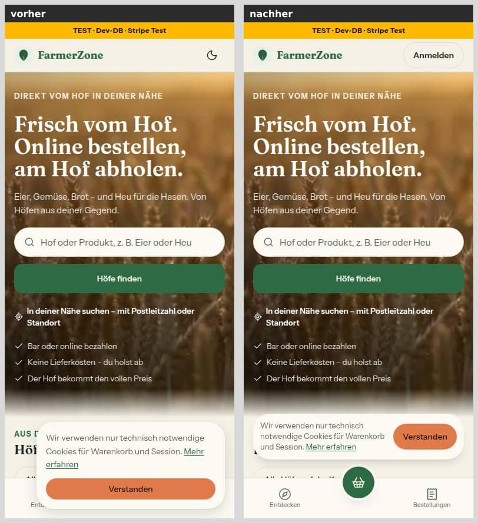
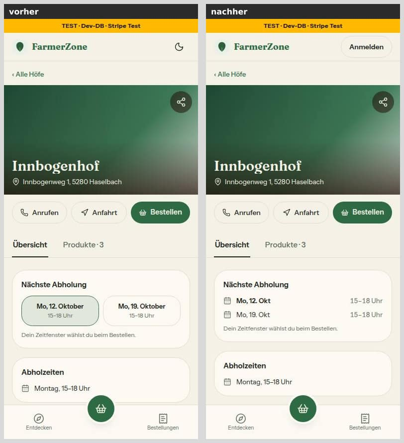
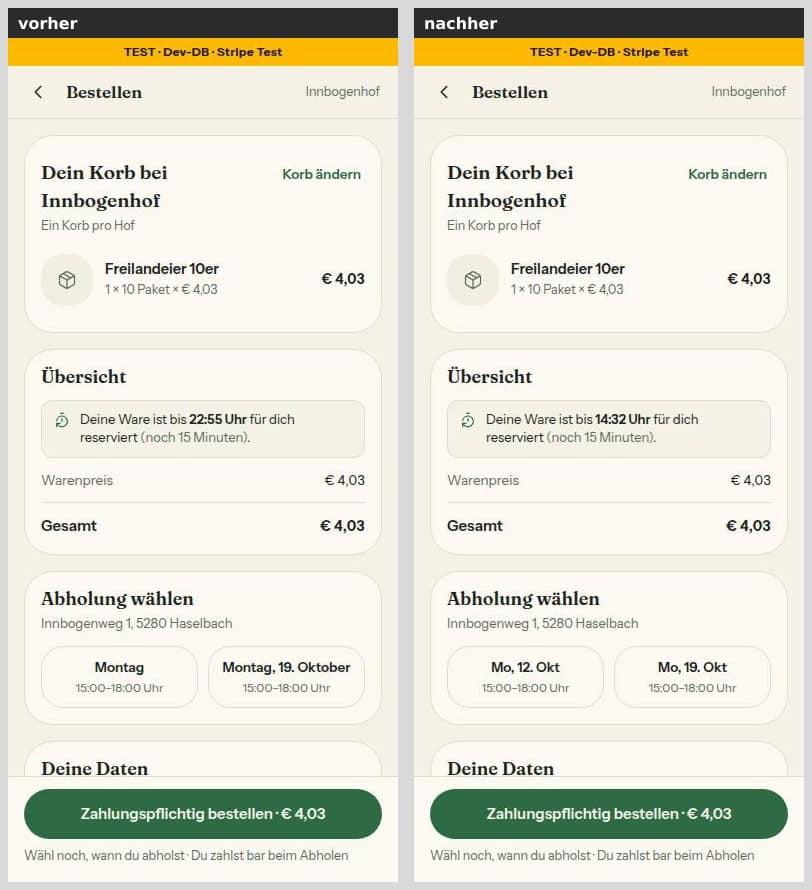
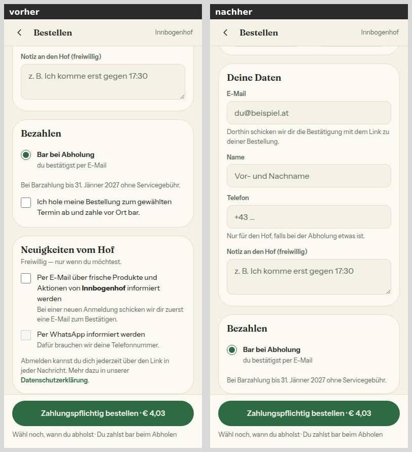
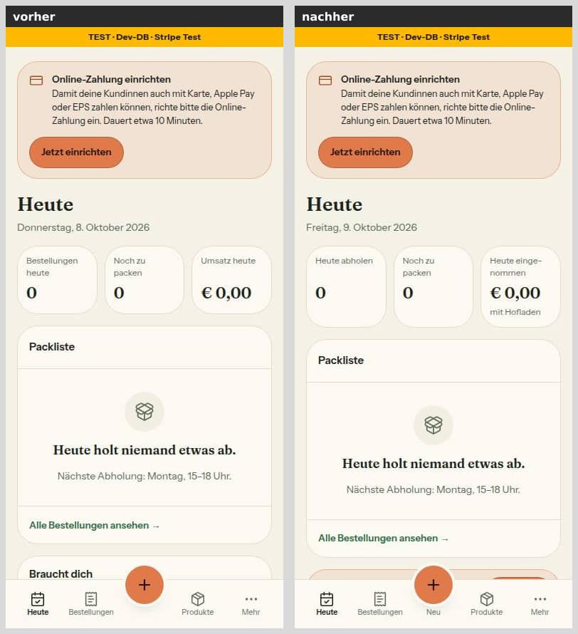
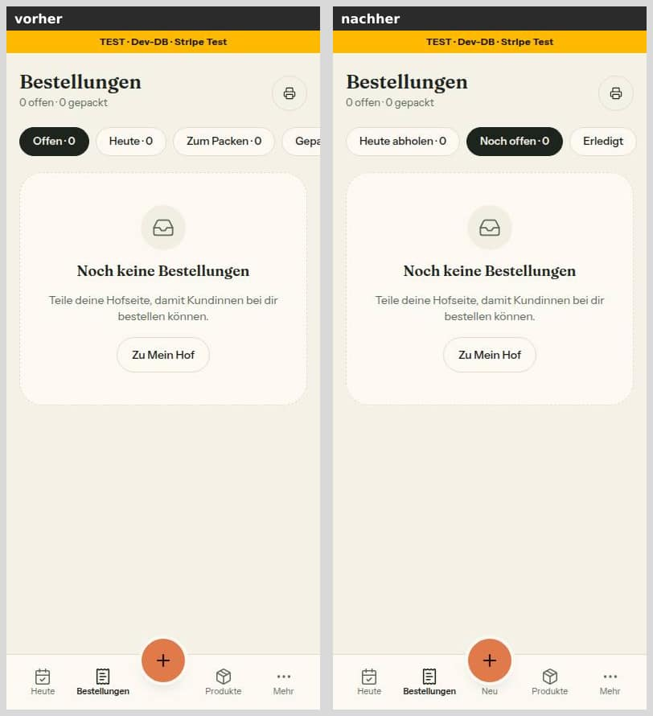
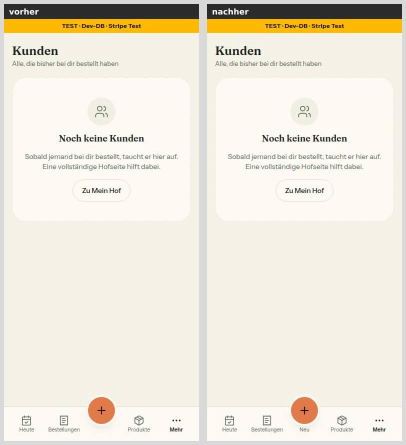
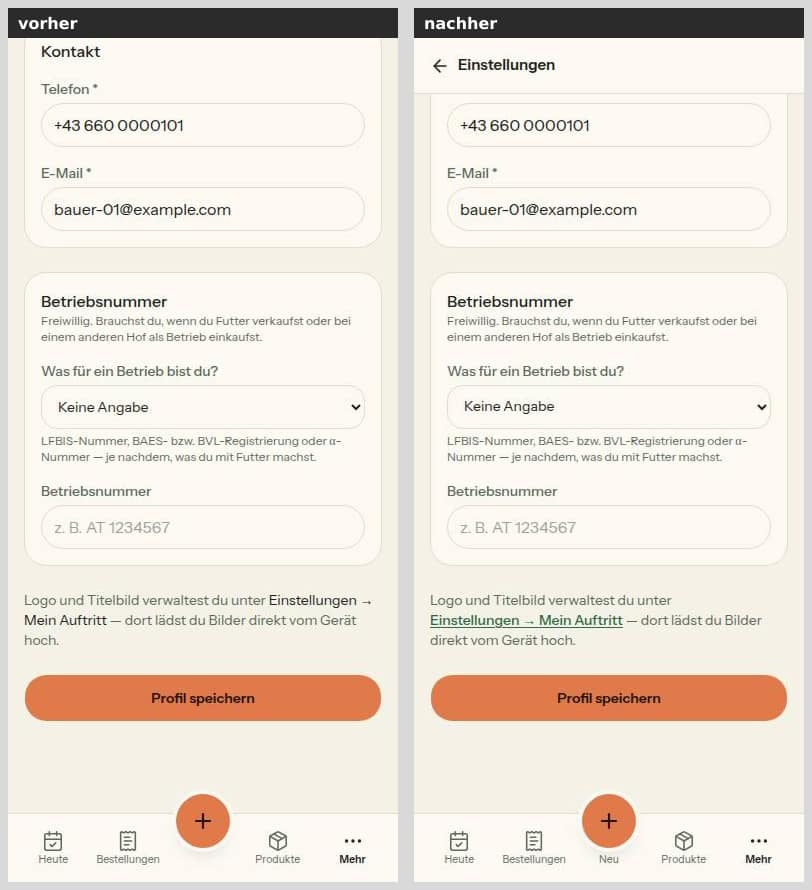

# Morgenbericht Nachtlauf 8 (2026-10-08/09)

Der Dirigent lief interaktiv in einer Cloud-Sitzung (Abschnitt 8 von `docs/nachtlauf.md`). uttoranger hat die Freigabe am 08.10.2026 im Chat erteilt und den Lauf am 09.10.2026 fortgesetzt; beides steht in `freigabe.md` §12.

Erledigt:
- Schritt 0, der Doku-PR #220.
- Die Nummern 41 bis 48 in der festen Reihenfolge. 43 ist auf 42 gestapelt.
- Der **Sammel-PR #229**, der Haltepunkt des Laufs.

Keine Nummer brauchte eine Migration, keine Nummer musste angehalten werden, und es gibt keine Entwürfe.

## 1. Probelauf (Nr. 48): Checkliste statt Lauf

**Ergebnis: erledigt (Checkliste), PR #225.** Es lief keine Zahlung, kein Aufruf an Stripe oder Vercel und kein Zugriff auf die Produktion.

- **Vorbedingung A** (Banner „Stripe Test") hast du am 08.10. selbst gelesen. Aus der Sitzung ließ sie sich nicht erneut lesen. Der einzige Weg wäre ein Vercel-Freigabelink gewesen, und der ist ein schreibender Aufruf. Entschlüsselt wurde nichts.
- **Vorbedingung B ist nicht erfüllt.** Die Netzwerkregeln der Sitzung sperren `*.vercel.app` und `api.stripe.com` (CONNECT 403).
- **Deshalb der Pfad „Sonst":** `docs/nachtlauf/probelauf-checkliste.md` beschreibt die zwölf Abläufe Schritt für Schritt für dich:
  - je Ablauf Testkarte, erwartete Anzeige, Beträge in ganzen Cent (gegen den Code nachgerechnet) und die Stellen im Stripe-Dashboard und im Admin;
  - vor jedem Geld-Schritt der Haken „Banner zeigt TEST · Dev-DB · Stripe Test";
  - drei getrennte Browserprofile (Hof, Admin, Kundin);
  - in der Produktion nur schauen, nie bestellen.
  - Sie entspricht dem Stand von 41 bis 47: Anmelden am Handy, Rückweg, Testbetrieb, Testumgebung samt Post-Sperre, drei Bestellfilter, Kasse ohne Haken, Neuigkeiten auf der Bestätigungsseite.
- **Webhook-Prüfung im Code: erfüllt, kein 48a.** Ein Ereignis zu einer unbekannten Bestellung oder einem unbekannten Konto quittiert der Webhook mit 200. Es gibt keine Wiederholungsschleife und keine Sentry-Meldung je Ereignis.
  - Die einzige Meldung ist gewollt: eine gescheiterte fremde Erstattung, einmal je Erstattung.
  - Nicht-2xx gibt es nur bei werfendem Handler, fehlendem Secret, gescheitertem Speichern (500), falscher Signatur (400) und der Modus-Wache aus 42 (503). Keiner dieser Wege hängt an einer fremden ID.
- **Gut zu wissen:** Vorschau und Produktion teilen den Test-Schlüssel, Test-Webhooks gehen an alle Test-Endpunkte. Die Testumgebung braucht einen eigenen Endpunkt, sonst bleibt dort jede Online-Bestellung auf „Zahlung wird geprüft" (Weg in `docs/betrieb/testumgebung.md`, Schritte 3 und 5).

## 2. PRs

| Nr | Auftrag | PR | Basis | Migration | Vorschau | Prüfung, Nachbesserungen | Entwurf? |
|---|---|---|---|---|---|---|---|
| 0 | Doku Lauf 8: Register N1, N2, Z2, Z3; Freigabe §12; Regel 9; Status | #220 | `main` | **nein** | [Vorschau](https://farmer-zone-git-docs-lauf8-bierbaron.vercel.app) | – | nein |
| 41 | Hof-Anmeldung am Handy und „Mein Hof" (N1) | #221 | `main` | **nein** | [Vorschau](https://farmer-zone-git-nacht-2026-10-0841-hof-anmeldung-bierbaron.vercel.app) | 3 „Sollte" (Wortmarke unter 420 px, Kundin sah „Anmelden", Rückgabetyp) in Runde 1 | nein |
| 42 | Stripe-Testbetrieb und Modus-Wache (Z2), Handbuch Live-Schaltung | #223 | `main` | **nein** | [Vorschau](https://farmer-zone-git-nacht-2026-10-0842-stripe-wache-bierbaron.vercel.app) | Wache fail-closed, strengere Konto-Erkennung, Protokoll (Runde 1); Idempotenz-Fenster, Haken für die Systemvariablen (Runde 2); zwei Nachprüfungen; Doku-Nachzug des Dirigenten | nein |
| 43 | Testumgebung test.farmerzone.at (Z3) | #226 | **#223** (42) | **nein** | [Vorschau](https://farmer-zone-git-nacht-2026-10-0843-testumgebung-bierbaron.vercel.app) | Post-Sperre fail-closed, Banner-Farben aus einer Quelle (Runde 1); Lücke „Punkt am Ende der Adresse" geschlossen (Runde 2); zwei Nachprüfungen, 57 Schreibweisen ohne Leck | nein |
| 44 | Rückweg im Hofbereich (N1) | #222 | `main` | **nein** | [Vorschau](https://farmer-zone-git-nacht-2026-10-0844-rueckweg-bierbaron.vercel.app) | 1 „Sollte" (Speichern während der Ortssuche verlor den Standort) in Runde 1 | nein |
| 45 | Hofbereich kinderleicht | #227 | `main` | **nein** | [Vorschau](https://farmer-zone-git-nacht-2026-10-0845-hofbereich-bierbaron.vercel.app) | Blocker „Satz zur Umsatzgrenze passt nicht zum Code" + 4 „Sollte" (Runde 1, mit WIP-Sicherung nach Abbruch); zusätzliche Nachprüfung, 2 „Sollte" (Runde 2) | nein, aber **Alternative freigeben** |
| 46 | Kundensicht kinderleicht (N2; Geldpfad) | #228 | `main` | **nein** | [Vorschau](https://farmer-zone-git-nacht-2026-10-0846-kundensicht-bierbaron.vercel.app) | 2 Sicherheits-„Sollte" (Neuigkeiten ohne Statusprüfung, Lese-Link mit Schreibweg) + Bilder (Runde 1); Nachprüfung ohne Befund außer Hinweisen, Nachzug des Dirigenten | nein |
| 47 | Altlasten aus Lauf 7 und Laufzeit-Befunde | #224 | `main` | **nein** | [Vorschau](https://farmer-zone-git-nacht-2026-10-0847-altlasten-bierbaron.vercel.app) | 4 „Sollte" (Runde 1); quadratische Muster im Sentry-Filter (Runde 2); zwei Nachprüfungen; Doku- und Test-Nachzug des Dirigenten | nein |
| 48 | Probelauf (Nachholung von 34) | #225 | `main` | **nein** | [Vorschau](https://farmer-zone-git-nacht-2026-10-0848-probelauf-bierbaron.vercel.app) | Checkliste: 3 „Sollte" (Kasse in der Produktion, Browserprofile, Banner vor jedem Geld-Schritt) in Runde 1; Nachzug nach 46 (Runde 2) | nein |
| Sammel | Alle obigen zusammengeführt | **#229** | `main` | **nein** | [Vorschau](https://farmer-zone-git-integration-lauf8-bierbaron.vercel.app) | Gesamtstand grün (Abschnitt 3) | nein |

Die Vorschau-Links sind Branch-Adressen und zeigen immer den neuesten Stand eines PR.

**Ablauf je Nummer:**
- Ein frischer Umsetzer, danach `tester` und `pruefer`, höchstens zwei Nachbesserungsrunden.
- Nachprüfung der Fix-Commits bei 42, 43, 46 und 47. Bei 45 hat der Dirigent wegen des Blockers zusätzlich nachprüfen lassen.
- Wo nach der letzten Runde nur Hinweise übrig waren, hat der Dirigent Doku und Tests selbst nachgezogen (42, 43, 46, 47); das steht jeweils im PR.
- Typecheck und Tests hat der Dirigent vor jedem Push selbst wiederholt.

**Unterbrechung und Fortsetzung (09.10.2026):**
- Eine Sitzungsgrenze brach die Umsetzer von 45 (mitten in Runde 1) und 46 (vor Runde 1) ab, danach wurde die Maschine neu gestartet.
- Der Arbeitsstand war in der Sitzung noch da. Wie im Fortsetzungsauftrag verlangt, ging er sofort auf origin: 45 als WIP-Commit 2cc1452, 46 mit seinen drei Commits. Eine Neuumsetzung war nicht nötig.
- Den WIP-Commit von 45 schließen e6817cf und 48491a4 ab. Er bleibt in der Historie, der PR erklärt ihn.

## 3. Sammel-PR #229 (`integration/lauf8`)

**Reihenfolge**, je `git merge --no-ff`: #220 → #221 → #223 → #226 → #222 → #227 → #228 → #224 → #225. Am Ende ist der Doku-Branch noch einmal hereingeholt (Status und dieser Bericht).

**Prüfung auf dem Gesamtstand:**
- `pnpm typecheck` grün.
- `pnpm lint` 13/7 wie auf `main` (dieselben Dateien, nur verschobene Zeilen).
- `pnpm test` **311 Dateien / 6110 Tests** grün.
- `pnpm test:integration` **40 / 350** grün.
- Kein Diff unter `prisma/`.

**Code-Konflikte, alle Änderungen erhalten:**
- **AdminShell, Admin-Layout, Admin-Navigation (41 · 42 · 43):** „Mein Hof" und die Konto-Plakette aus 41, die orange Testmodus-Karte aus 42, die Stripe-Marke und „Zur Testumgebung" aus 43. Alle Props gehen zusammen weiter, und beide Konstanten stehen nebeneinander.
  - Zwei Tests aus 42 und 43 rendern die Shell ohne das seit 41 verlangte `hatHof`; sie geben `hatHof: false` mit.
- **Kunden-Detail und Ladeansicht (44 · 45):** Der Aufbau aus 44 bleibt (fester Kopf, neue Einrückung), dazu kommt aus 45 der Satz mit den Links „Noch offen" und „Erledigt".
  - Ein Test aus 45 nutzte die alte Shell-Eigenschaft `angemeldet`; er nimmt jetzt `sitzung: 'gast'` aus 41.
- **Datenbank-Bremse (42 · 46):** Beide neuen Einträge stehen in `DB_BREMSEN`.
- **E-Mail-Versand (43 · 47):** `sendRaw` hat die Post-Sperre aus 43 und die Abmelde-Kopfzeilen aus 47. Die Kopfzeilen gehen nur an Resend, wenn die Sperre durchlässt.
- **Ohne Textkonflikt geprüft:**
  - Der Testbetrieb-Hinweis aus 42 steht in der neuen Kasse aus 46.
  - Die Quelltext-Wache aus 47 ist mit der neuen Neuigkeiten-Action aus 46 grün.
  - `settings/payments` (42 und 44) passt zusammen.

**Doku-Konflikte:**
- `DEVELOPMENT.md`: beide Seiten behalten, die Einträge stehen nacheinander.
- In `docs/ai/DESIGN_SYSTEM.md` und `ARCHITECTURE.md` haben zwei PRs oft verschiedene Stellen derselben Zeile geändert. Diese Zeilen sind auf Wortebene gegen `main` zusammengeführt.
- Wo ein PR eine Zeile ersetzt hat, steht nur noch die neue Fassung. Beispiele: `UnterseitenKopf` statt `EinstellungenKopf`; ein Heute-Absatz statt drei, ohne `teilenKarte`.
- **Kontrolle:** Jedes Stück, das ein PR in `DEVELOPMENT.md` oder `docs/ai/*` eingefügt hat, steht im Ergebnis. Kein ersetztes Stück steht noch darin.

**Merge-Empfehlung:** Nur **#229** mergen, per Merge-Commit; die Einzel-PRs gelten danach als gemergt. Wer lieber einzeln merged, nimmt die Reihenfolge oben, **#223 vor #226**.

## 4. Bilderstrecke „Handy vorher/nachher" (390 px, hell)

Vorher ist `main` (9c7da65), nachher `integration/lauf8`, beide lokal gegen die Test-Datenbank mit erfundenen Seed-Daten. Der Seed-Hof hat dort weder Bestellungen noch Kunden, darum zeigen Bestellungen und Kunden den leeren Zustand. Bilder in beiden Themes und in 1440 px stehen in den Berichten der Nummern.

**Startseite ausgeloggt** (41: „Anmelden" oben; 46: Cookie-Hinweis als flache Zeile)

**Für Höfe** (41: „Schon dabei? Anmelden")

**Hofseite** (41: „Anmelden" oben; 46: nächste Abholung als Zeilen mit Datum)

**Kasse** (46: Termine mit Datum; kein Bar-Haken, keine Neuigkeiten-Haken; Beträge unverändert)

**Heute** (45: „Heute abholen", „Heute eingenommen mit Hofladen", „Neu" unter dem Plus)

**Bestellungen** (45: genau drei Filter)

**Kunden** (45: „Sortieren" statt Auswahlfeld, höchstens zwei Filter sichtbar)

**Hof-Profil unten** (44: „Mein Auftritt" ist ein Link; 45: Fachwörter erklärt)

## 5. Für dich zu tun

1. **Testumgebung einrichten** nach `docs/betrieb/testumgebung.md`:
   - den Branch `staging` anlegen; bis dahin meldet die Action nur einen Hinweis;
   - die Domain test.farmerzone.at auf `staging` legen, DNS „Nur DNS";
   - Variablen nur für den Branch, darunter `TEST_EMPFAENGER` mit deinen Adressen und `SUPPORT_EMAIL`;
   - einen eigenen Stripe-Webhook im Testmodus samt Weg an der Vercel-Sperre vorbei. Das Bypass-Geheimnis öffnet alle geschützten Deployments des Projekts und ist im Stripe-Dashboard lesbar.
2. **Probelauf nach `docs/nachtlauf/probelauf-checkliste.md`:**
   - an test.farmerzone.at, solange es die nicht gibt an der Vorschau von `integration/lauf8`;
   - mit drei Browserprofilen;
   - Abschnitt 11 ausfüllen; jeder Fehler wird eine Nummer 48a, 48b …
3. **Freigaben, gesammelt** (Einzelheiten in den PRs):
   - **Mockup-Abweichungen:** alle mit Bild in den Berichten von 41, 42, 43, 44, 45 und 46.
   - **42:** Die Wache ist strenger als der Wortlaut (Live nur bei `VERCEL_ENV=production`). „Neu einrichten" erscheint erst nach einem Konto-Aufruf.
   - **43:** Post-Sperre fail-closed, die echte Produktion ist nicht betroffen.
   - **44:** Schalter mit sofortiger Wirkung bleiben auf der Seite. Auf `/fehler-melden` steht derselbe Name doppelt, so wie in §12.
   - **45:** Kennzahlen in drei Spalten wie auf `main`. Die Alternative 2 + 1 bis 1024 px liegt als Bild im Bericht. Annahme: Der Balken der Shell zählt nicht als Kasten von Heute.
   - **46 (Restrisiko):** Bei bezahlten Bestellungen bleibt „Neuigkeiten" ohne Frist erlaubt, höchstens drei Bestätigungsmails am Tag, nur gegen echtes Geld.
   - **47:** Die Ein-Klick-Abmeldung schaltet E-Mail **und** WhatsApp für diesen Hof aus, wie der Link. Die E-Mail-Muster im Sentry-Filter sind über den Auftrag hinaus erneuert.
4. **Datenschutzerklärung anpassen (nach dem Merge von 46):**
   - §9 verspricht noch „beim Abschluss einer Bestellung … E-Mail und/oder WhatsApp". Jetzt meldet man sich auf der Bestätigungsseite an, nur per E-Mail, mit Klick in der Bestätigungsmail.
   - Im Abschnitt Umkreissuche heißt der Knopf „In meiner Nähe" statt „Standort nutzen".
   - Satzvorschlag im Bericht 46.
5. **Entscheidung fürs Register:** Neuigkeiten per WhatsApp haben seit 46 keinen Einstieg mehr (nur noch über „Mein Konto" bei einem bestehenden Abo).
6. **Brennholz-Zahl (45):** Die Abfrage steht im Bericht 45 und liest nur. Sie gibt nur Hof-IDs und Anzahlen aus, im SQL-Editor ausführen. Brennholz in m³ bitte auf rm umstellen, Hackschnitzel auf srm (E11). Das macht jeder Hof in seinem Produkt.
7. **Als letzter Schritt: die Live-Schaltung** nach `docs/betrieb/stripe-live.md`.
   - Zuerst die Systemvariablen bei Vercel prüfen („Automatically expose System Environment Variables"). Ohne sie startet die Wache aus 42 keinen Live-Schlüssel.
   - Dann zuerst EIN Hof, danach die übrigen.
   - Kein Lauf schaltet um.

## 6. Offen und Altlasten (nicht Teil dieses Laufs)

- **Sentry-Filter:**
  - Die E-Mail-Muster erfassen nur ASCII.
  - Doppelt kodierte Adressen (`%2540`) fallen nicht weg.
  - Ein Token in einer relativen Adresse bleibt in `exception.value` stehen (Bericht 47).
- **Abmelde-Token:** ohne Zweck im signierten Teil, die Adresse ist lesbar. Ein neues Format bräuchte einen Übergang für schon verschickte Links (Bericht 47).
- **`bargebuehr.int.test.ts`** wackelt unter Last (Geldpfad-Test, der Nachlauf der Mail wird zu früh geprüft). Er war in allen Gesamtläufen grün (Bericht 45).
- **Hofbereich:**
  - Die Feldhinweise „Steht auf dem Sackanhänger" sind für eigene Ernte ungenau.
  - „Online-Zahlung einrichten" steht zusätzlich als Erste-Schritte-Schritt neben dem Stripe-Kasten.
- **Testumgebung:**
  - Erkannt wird nur farmerzone.at und www, eine Vercel-Adresse der Produktion gälte als fremd.
  - In der Produktion übernimmt `trustedOrigins` `NEXT_PUBLIC_APP_URL` weiter roh.
- **Webhook:** Fremde Ereignisse legen in der Produktion Zeilen in `WebhookEvent` an; aufgeräumt wird die Tabelle nicht.
- **Umgebung des Laufs:**
  - Der gemeinsame Vergleichsserver ist am 08.10. am Speicher gestorben (OOM). Danach lief immer nur ein Dev-Server gleichzeitig.
  - Am 09.10. wurde die Maschine neu gestartet. Postgres ist neu gestartet, nichts ging verloren.
